# MicroPython WorkBench 项目架构文档

## 文档信息

| 项目 | 内容 |
|------|------|
| 版本 | v2.0 |
| 日期 | 2026-01-20 |
| 状态 | 生产就绪 |
| 目标受众 | 新加入的开发人员 |

---

## 第一部分：项目简介

### 1.1 项目概述

**MicroPython WorkBench** 是一个 VS Code 扩展，为 MicroPython 开发提供完整的 IDE 体验。主要功能包括：

- 🔌 **设备连接管理** - 自动检测和连接 MicroPython 设备
- 📁 **文件系统操作** - 浏览、上传、下载、删除设备文件
- 💻 **REPL 终端** - 支持中文输入的交互式终端
- 🔄 **文件同步** - 本地与设备间的双向同步
- ▶️ **代码执行** - 直接在设备上运行 Python 代码
- 🎨 **语法补全** - MicroPython 代码智能提示

### 1.2 技术栈

| 层级 | 技术 |
|------|------|
| 前端 | TypeScript + VS Code Extension API |
| 后端 | Python 3.x |
| 通信协议 | JSON-RPC over stdin/stdout |
| 设备协议 | Raw Paste Mode (MicroPython) |
| 串口通信 | pyserial |

### 1.3 核心设计理念

1. **长连接架构** - 一次连接，持续使用，避免频繁的连接开销
2. **客户端编辑** - 所有输入编辑在 VS Code 侧完成，支持 UTF-8/中文
3. **Raw Paste 模式** - 通过二进制协议提交代码，绕过设备端 readline 限制
4. **分层解耦** - TypeScript 前端与 Python 后端通过 IPC 通信，职责分明

---

## 第二部分：系统架构

### 2.1 整体架构图

```mermaid
flowchart TB
    subgraph VSCode["VS Code 扩展 (TypeScript)"]
        subgraph UI["用户界面层"]
            TreeView["文件树视图<br/>Esp32Tree"]
            Terminal["REPL 终端<br/>Pseudoterminal"]
            StatusBar["状态栏"]
        end
        
        subgraph Commands["命令层"]
            FileCmd["fileCommands"]
            SyncCmd["syncCommands"]
            BoardCmd["boardCommands"]
            ReplCmd["replCommands"]
        end
        
        subgraph Core["核心服务层"]
            Extension["extension.ts<br/>入口点"]
            Adapter["DeviceAdapter<br/>设备适配器"]
            SessionMgr["SessionManager<br/>会话管理"]
            ReplMgr["ReplTerminalManager<br/>REPL管理"]
        end
        
        subgraph Backend["后端通信层"]
            BackendProc["BackendProcess<br/>进程管理"]
            IPCClient["IPCClient<br/>消息通信"]
        end
    end
    
    subgraph Python["Python 后端 (mpy_backend)"]
        IPCServer["IPCServer<br/>消息服务"]
        Session["DeviceSession<br/>设备会话"]
        Protocol["RawPasteProtocol<br/>Raw协议"]
        Serial["SerialConnection<br/>串口连接"]
    end
    
    Device["MicroPython 设备"]
    
    UI --> Commands
    Commands --> Core
    Core --> Backend
    Backend <-->|"JSON-RPC<br/>stdin/stdout"| IPCServer
    IPCServer --> Session
    Session --> Protocol
    Protocol --> Serial
    Serial <-->|"Raw REPL 协议<br/>串口"| Device
    
    style VSCode fill:#e3f2fd
    style Python fill:#e8f5e9
    style Device fill:#fff3e0
```

### 2.2 数据流图

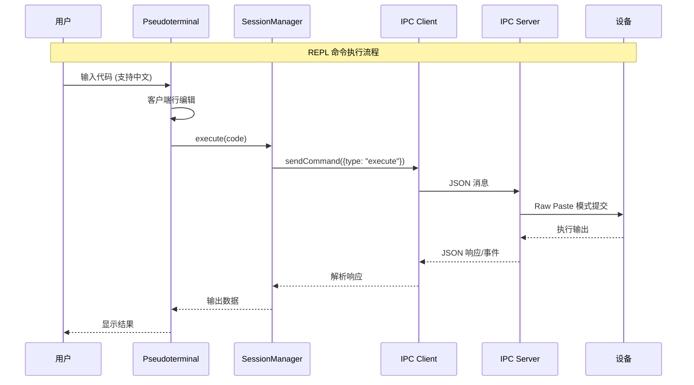

### 2.3 组件通信机制

#### 2.3.1 TypeScript ↔ Python 通信

使用 JSON-RPC 风格的消息协议通过 stdin/stdout 通信：

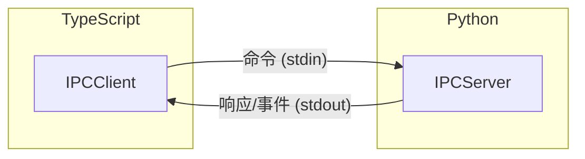

**消息类型：**

| 类型 | 方向 | 用途 |
|------|------|------|
| Command | TS → Python | 请求执行操作 |
| Response | Python → TS | 命令执行结果 |
| Event | Python → TS | 异步事件推送 |

**消息格式示例：**

```json
// 命令消息
{
  "type": "command",
  "id": "cmd_12345",
  "command": "execute",
  "data": {
    "session_id": "session_abc",
    "code": "print('Hello')"
  }
}

// 响应消息
{
  "type": "response",
  "id": "cmd_12345",
  "success": true,
  "data": {
    "stdout": "Hello\n",
    "stderr": ""
  }
}

// 事件消息
{
  "type": "event",
  "event": "output",
  "data": {
    "session_id": "session_abc",
    "stream": "stdout",
    "data": "Hello\n"
  }
}
```

#### 2.3.2 Python 后端 ↔ 设备通信

使用 MicroPython Raw Paste 协议：

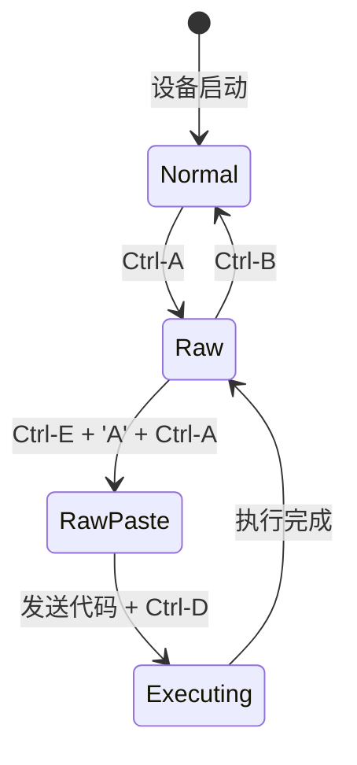

**协议控制码：**

| 控制码 | 字节 | 作用 |
|--------|------|------|
| Ctrl-A | `\x01` | 进入 Raw REPL |
| Ctrl-B | `\x02` | 退出到 Normal 模式 |
| Ctrl-C | `\x03` | 中断执行 |
| Ctrl-D | `\x04` | 结束输入/软重启 |
| Ctrl-E | `\x05` | 进入 Paste 模式 |

---

## 第三部分：项目目录结构

```
VScodeMicroPython/
├── src/                          # 源代码根目录
│   ├── core/                     # 核心模块
│   │   ├── extension.ts          # 扩展入口点
│   │   ├── types.ts              # 类型定义
│   │   ├── localization.ts       # 国际化
│   │   ├── workspaceUtils.ts     # 工作区工具
│   │   └── utilityOperations.ts  # 通用操作
│   │
│   ├── backend/                  # 后端进程管理
│   │   ├── BackendProcess.ts     # Python 进程生命周期
│   │   ├── IPCClient.ts          # IPC 通信客户端
│   │   ├── messages.ts           # 消息类型定义
│   │   └── index.ts              # 模块导出
│   │
│   ├── session/                  # 会话管理
│   │   ├── SessionManager.ts     # 多会话管理器
│   │   ├── DeviceSession.ts      # 单设备会话
│   │   └── index.ts              # 模块导出
│   │
│   ├── terminal/                 # 终端相关
│   │   ├── MpyPseudoterminal.ts  # 虚拟终端实现
│   │   ├── ReplTerminalManager.ts # REPL 管理器
│   │   ├── InputHandler.ts       # 输入处理
│   │   ├── HistoryManager.ts     # 历史记录
│   │   └── index.ts              # 模块导出
│   │
│   ├── board/                    # 设备操作
│   │   ├── deviceAdapter.ts      # 设备适配器接口
│   │   ├── deviceAdapterImpl.ts  # 适配器实现
│   │   ├── boardOperations.ts    # 板卡操作
│   │   ├── esp32Fs.ts            # 文件系统视图
│   │   └── syncSessionManager.ts # 同步会话管理
│   │
│   ├── commands/                 # VS Code 命令
│   │   ├── fileCommands.ts       # 文件操作命令
│   │   ├── syncCommands.ts       # 同步命令
│   │   ├── boardCommands.ts      # 板卡命令
│   │   ├── replCommands.ts       # REPL 命令
│   │   ├── debugCommands.ts      # 调试命令
│   │   └── utilityCommands.ts    # 工具命令
│   │
│   ├── cache/                    # 缓存模块
│   │   └── fileTreeCache.ts      # 文件树缓存
│   │
│   ├── utils/                    # 工具函数
│   │   └── pathMapping.ts        # 路径映射
│   │
│   ├── sync/                     # 同步功能
│   │   ├── sync.ts               # 同步逻辑
│   │   ├── syncView.ts           # 同步视图
│   │   └── syncOperations.ts     # 同步操作
│   │
│   ├── ui/                       # UI 组件
│   │   └── decorations.ts        # 文件装饰
│   │
│   ├── completion/               # 代码补全
│   │   └── codeCompletion.ts     # 补全提供器
│   │
│   └── python/                   # Python 相关
│       ├── mpy_backend/          # Python 后端代码
│       │   ├── __main__.py       # 入口点
│       │   ├── server.py         # IPC 服务器
│       │   ├── session.py        # 会话管理
│       │   ├── handlers.py       # 命令处理器
│       │   ├── device/           # 设备通信
│       │   │   ├── connection.py     # 连接抽象
│       │   │   ├── serial_connection.py # 串口实现
│       │   │   ├── protocol.py       # Raw 协议
│       │   │   └── device_manager.py # 设备管理
│       │   ├── messages/         # 消息定义
│       │   │   └── types.py      # 类型定义
│       │   └── utils/            # 工具函数
│       ├── pythonDetector.ts     # Python 检测
│       ├── pythonInterpreter.ts  # Python 解释器
│       └── pyraw.ts              # PyRaw 调用
│
├── assets/                       # 静态资源
├── docs/                         # 文档
├── tests/                        # 测试文件
├── media/                        # 媒体文件
├── package.json                  # 扩展配置
└── tsconfig.json                 # TypeScript 配置
```

---

## 第四部分：核心模块详解

### 4.1 后端进程管理 (BackendProcess)

**文件**: `src/backend/BackendProcess.ts`

**职责**:
- 启动和管理 Python 后端进程
- 自动重启崩溃的后端
- 转发后端事件到 TypeScript

**关键接口**:

```typescript
class BackendProcess extends EventEmitter {
    // 启动后端进程
    async start(): Promise<void>;
    
    // 停止后端进程
    async stop(): Promise<void>;
    
    // 发送命令并等待响应
    async sendCommand<T>(command: CommandMessage): Promise<T>;
    
    // 获取当前状态
    getState(): BackendState;
}
```

**状态机**:

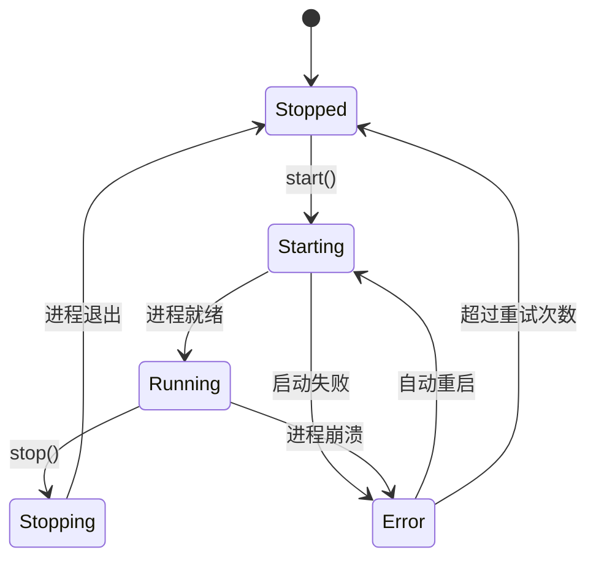

### 4.2 IPC 通信 (IPCClient)

**文件**: `src/backend/IPCClient.ts`

**职责**:
- JSON 消息序列化/反序列化
- 请求/响应匹配
- 超时处理
- 事件分发

**工作原理**:

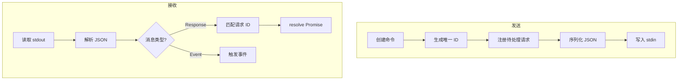

### 4.3 会话管理 (SessionManager)

**文件**: `src/session/SessionManager.ts`

**职责**:
- 管理多个设备会话
- 后端进程生命周期
- 事件转发

**使用模式**:

```typescript
// 初始化
const manager = new SessionManager({ context });
await manager.initialize();

// 创建会话
const session = await manager.createSession({ port: 'COM3' });
await session.connect();

// 执行代码
const result = await session.execute('print("Hello")');

// 清理
await manager.dispose();
```

### 4.4 设备会话 (DeviceSession)

**文件**: `src/session/DeviceSession.ts`

**职责**:
- 表示到单个设备的连接
- 提供高级 API（执行、文件操作）
- 状态管理

**会话状态**:

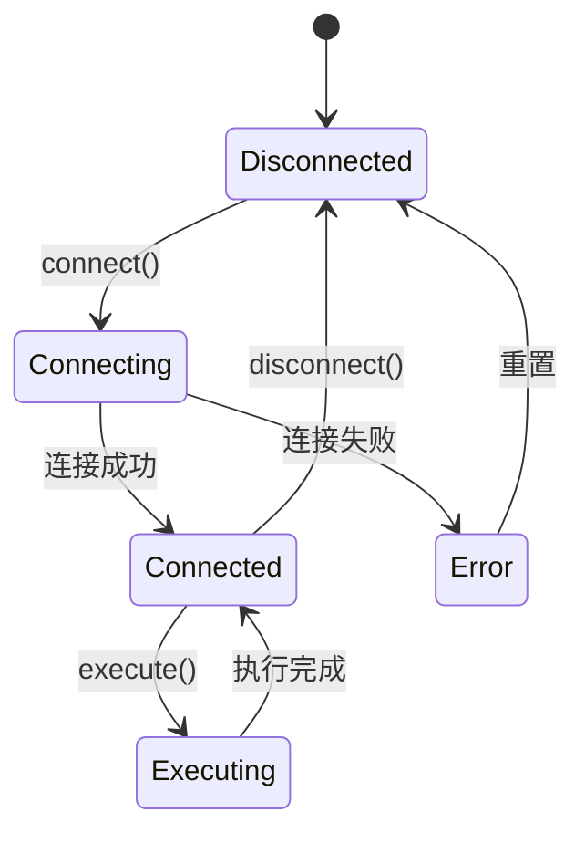

### 4.5 虚拟终端 (MpyPseudoterminal)

**文件**: `src/terminal/MpyPseudoterminal.ts`

**职责**:
- 实现 VS Code Pseudoterminal 接口
- 客户端行编辑（支持 UTF-8）
- 命令历史
- 输出渲染

**关键特性**:

| 特性 | 实现方式 |
|------|----------|
| UTF-8 输入 | 客户端编辑，Raw Paste 提交 |
| 历史记录 | HistoryManager |
| 中断执行 | Ctrl-C → interrupt 命令 |
| 多行输入 | 检测未闭合括号/冒号 |

### 4.6 设备适配器 (DeviceAdapter)

**文件**: `src/board/deviceAdapter.ts`, `src/board/deviceAdapterImpl.ts`

**职责**:
- 提供统一的设备操作接口
- 封装后端通信细节
- 向后兼容旧代码

**接口概览**:

```typescript
interface DeviceAdapter {
    // 文件操作
    ls(path: string): Promise<string[]>;
    lsTyped(path: string): Promise<FileEntry[]>;
    mkdir(path: string): Promise<void>;
    readFile(path: string): Promise<string>;
    writeFile(path: string, content: string): Promise<void>;
    deleteFile(path: string): Promise<void>;
    deleteDirectory(path: string): Promise<void>;
    cpToDevice(localPath: string, devicePath: string): Promise<void>;
    cpFromDevice(devicePath: string, localPath: string): Promise<void>;
    
    // 设备控制
    execute(code: string): Promise<ExecuteResult>;
    interrupt(): Promise<void>;
    reset(): Promise<void>;
    detectBoardInfo(): Promise<BoardInfo | null>;
    listSerialPorts(): Promise<SerialPortInfo[]>;
}
```

### 4.7 REPL 终端管理器 (ReplTerminalManager)

**文件**: `src/terminal/ReplTerminalManager.ts`

**职责**:
- REPL 终端生命周期管理
- 与 DeviceSession 集成
- 暂停/恢复（用于文件同步）
- 运行文件功能

**单例模式**:

```typescript
// 获取实例
const manager = ReplTerminalManager.getInstance();

// 打开 REPL
await manager.open('COM3');

// 暂停（用于文件操作）
const snapshot = await manager.suspend();

// 恢复
await manager.restore(snapshot);

// 运行文件
await manager.runFile('/path/to/file.py');
```

---

## 第五部分：功能工作原理

### 5.1 设备连接流程

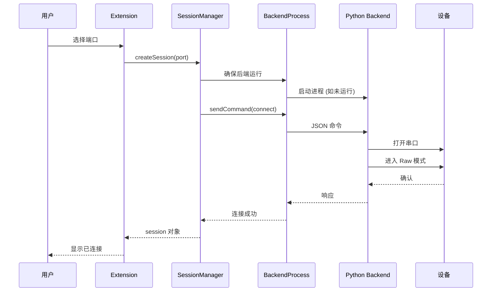

### 5.2 代码执行流程

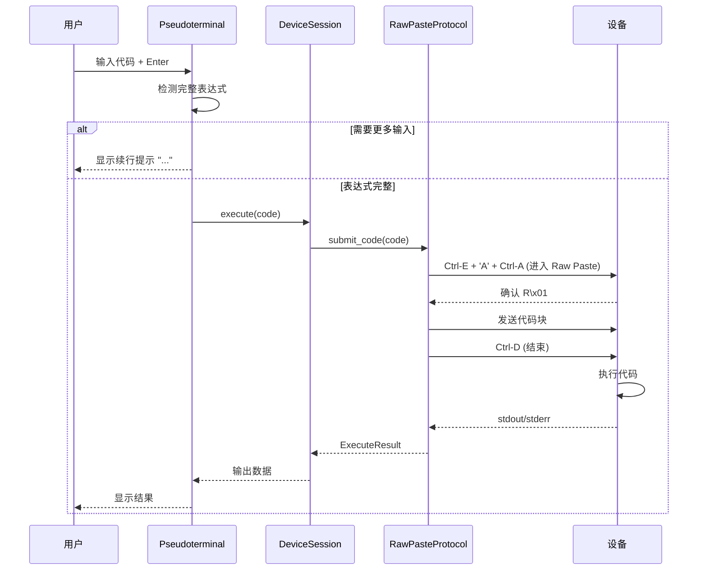

### 5.3 文件上传流程

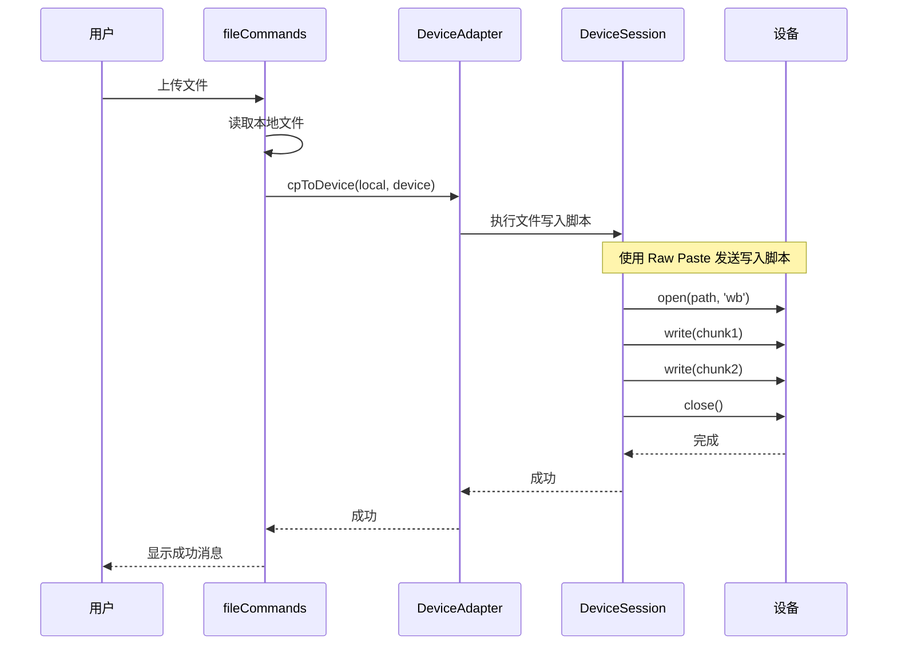

### 5.4 文件同步机制

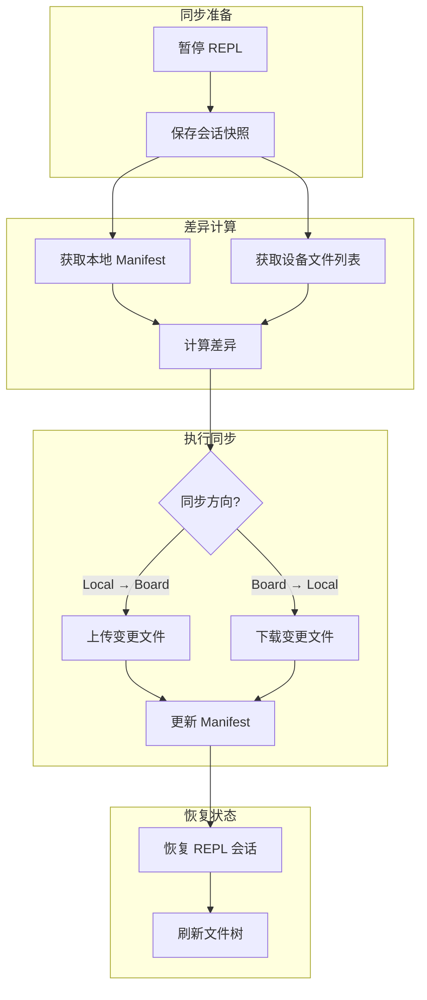

### 5.5 UTF-8/中文输入支持

**问题**: MicroPython 设备的 readline.c 只接受 ASCII 32-126 字符

**解决方案**: 客户端编辑 + Raw Paste 模式

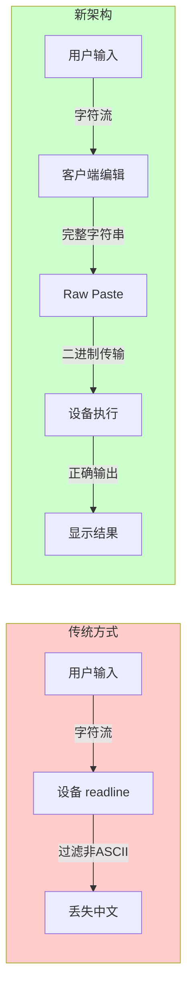

---

## 第六部分：开发指南

### 6.1 开发环境设置

```bash
# 1. 克隆仓库
git clone <repo-url>
cd VScodeMicroPython

# 2. 安装依赖
npm install

# 3. 编译 TypeScript
npm run compile

# 4. 安装 Python 依赖 (用于后端开发)
pip install pyserial

# 5. 在 VS Code 中打开
code .

# 6. 按 F5 启动调试
```

### 6.2 编码规范

#### TypeScript 规范

```typescript
// ✅ 使用明确的类型声明
function processFile(path: string): Promise<FileEntry[]> { }

// ✅ 使用 async/await 而非回调
async function readFile(path: string): Promise<string> {
    const result = await session.execute(`...`);
    return result.stdout;
}

// ✅ 错误处理
try {
    await operation();
} catch (error: unknown) {
    if (error instanceof Error) {
        console.error('Operation failed:', error.message);
    }
    throw error;
}

// ✅ 使用 EventEmitter 模式
class DeviceSession extends EventEmitter {
    private emit(event: 'output', data: string): boolean;
    private emit(event: 'error', error: Error): boolean;
}
```

#### Python 规范

```python
# ✅ 使用类型注解
def execute_code(self, code: str) -> ExecuteResult:
    ...

# ✅ 使用 dataclass
@dataclass
class ExecuteResult:
    stdout: str
    stderr: str
    success: bool

# ✅ 使用日志而非 print
import logging
logger = logging.getLogger(__name__)
logger.debug("Processing command: %s", command)
```

### 6.3 添加新命令

1. **在命令模块中实现功能**:

```typescript
// src/commands/myCommands.ts
export const myCommands = {
    myNewCommand: async () => {
        const adapter = getDeviceAdapter();
        const result = await adapter.execute('...');
        vscode.window.showInformationMessage(result.stdout);
    }
};
```

2. **在 package.json 中注册命令**:

```json
{
    "contributes": {
        "commands": [
            {
                "command": "microPythonWorkBench.myNewCommand",
                "title": "My New Command",
                "category": "MicroPython"
            }
        ]
    }
}
```

3. **在 extension.ts 中绑定**:

```typescript
context.subscriptions.push(
    vscode.commands.registerCommand(
        'microPythonWorkBench.myNewCommand',
        myCommands.myNewCommand
    )
);
```

### 6.4 添加新的后端命令

1. **定义消息类型** (`src/python/mpy_backend/messages/types.py`):

```python
class CommandType(str, Enum):
    MY_COMMAND = "my_command"
```

2. **实现处理器** (`src/python/mpy_backend/handlers.py`):

```python
def handle_my_command(cmd: CommandMessage, sessions: dict) -> ResponseMessage:
    # 实现逻辑
    return MessageFactory.create_response(
        cmd.id,
        success=True,
        data={"result": "..."}
    )
```

3. **注册处理器**:

```python
server.register_handler(CommandType.MY_COMMAND, handle_my_command)
```

4. **TypeScript 端调用**:

```typescript
const response = await backend.sendCommand(
    MessageFactory.createCommand('my_command', { ... })
);
```

### 6.5 调试技巧

#### 启用调试日志

```json
// .vscode/settings.json
{
    "microPythonWorkBench.debug": true
}
```

#### 查看后端日志

```typescript
// BackendProcess 会将 stderr 输出到 Output Channel
// 在 VS Code 中: View > Output > MicroPython Backend
```

#### 测试 IPC 通信

```python
# 直接运行后端测试
python -m mpy_backend --debug
```

---

## 第七部分：注意事项

### 7.1 串口独占

⚠️ 同一时间只能有一个进程访问串口

**解决方案**: 使用 `suspendSerialSessionsForAutoSync` / `restoreSerialSessionsFromSnapshot`

```typescript
// 文件操作前
const snapshot = await suspendSerialSessionsForAutoSync();

try {
    await performFileOperation();
} finally {
    // 恢复 REPL
    await restoreSerialSessionsFromSnapshot(snapshot);
}
```

### 7.2 跨平台兼容

| 平台 | 串口格式 | 注意事项 |
|------|----------|----------|
| Windows | COM3, COM4 | 需要驱动 |
| Linux | /dev/ttyUSB0 | 需要 dialout 组权限 |
| macOS | /dev/cu.usbserial-* | 需要安装驱动 |

### 7.3 设备兼容性

| 设备 | 支持状态 | 备注 |
|------|----------|------|
| ESP32 | ✅ 完全支持 | 推荐 |
| ESP32-S2/S3 | ✅ 完全支持 | |
| ESP8266 | ✅ 支持 | 内存较小 |
| Raspberry Pi Pico | ✅ 支持 | |
| STM32 | ⚠️ 部分支持 | 需测试 |

### 7.4 常见问题

| 问题 | 原因 | 解决方案 |
|------|------|----------|
| 无法连接设备 | 串口被占用 | 关闭其他串口程序 |
| 中文显示乱码 | 编码问题 | 确保使用 UTF-8 |
| 文件上传失败 | 设备空间不足 | 清理设备文件 |
| REPL 无响应 | 设备卡死 | 按复位按钮 |

---

## 第八部分：参考资料

### 8.1 项目相关

- [MicroPython 官方文档](https://docs.micropython.org/)
- [VS Code Extension API](https://code.visualstudio.com/api)
- [pyserial 文档](https://pyserial.readthedocs.io/)

### 8.2 技术文档

- [MicroPython Raw REPL 协议](https://docs.micropython.org/en/latest/reference/repl.html)
- [VS Code Pseudoterminal API](https://code.visualstudio.com/api/references/vscode-api#Pseudoterminal)

### 8.3 相关项目

- [minny](https://github.com/pybricks/minny) - Raw Paste 协议参考实现
- [mpremote](https://github.com/micropython/micropython/tree/master/tools/mpremote) - MicroPython 官方工具

---

## 附录：术语表

| 术语 | 说明 |
|------|------|
| Raw REPL | MicroPython 的机器友好输入模式 |
| Raw Paste | Raw REPL 的增强模式，支持流控制 |
| Pseudoterminal | VS Code 虚拟终端，支持客户端编辑 |
| IPC | 进程间通信 (Inter-Process Communication) |
| Session | 到单个设备的连接会话 |
| DeviceAdapter | 设备操作的统一接口层 |
| Manifest | 文件同步的元数据文件 |
