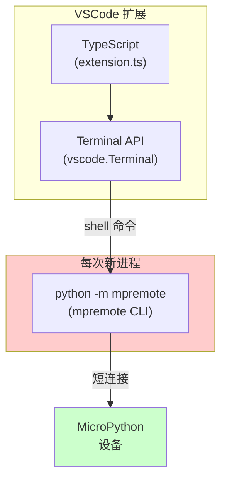
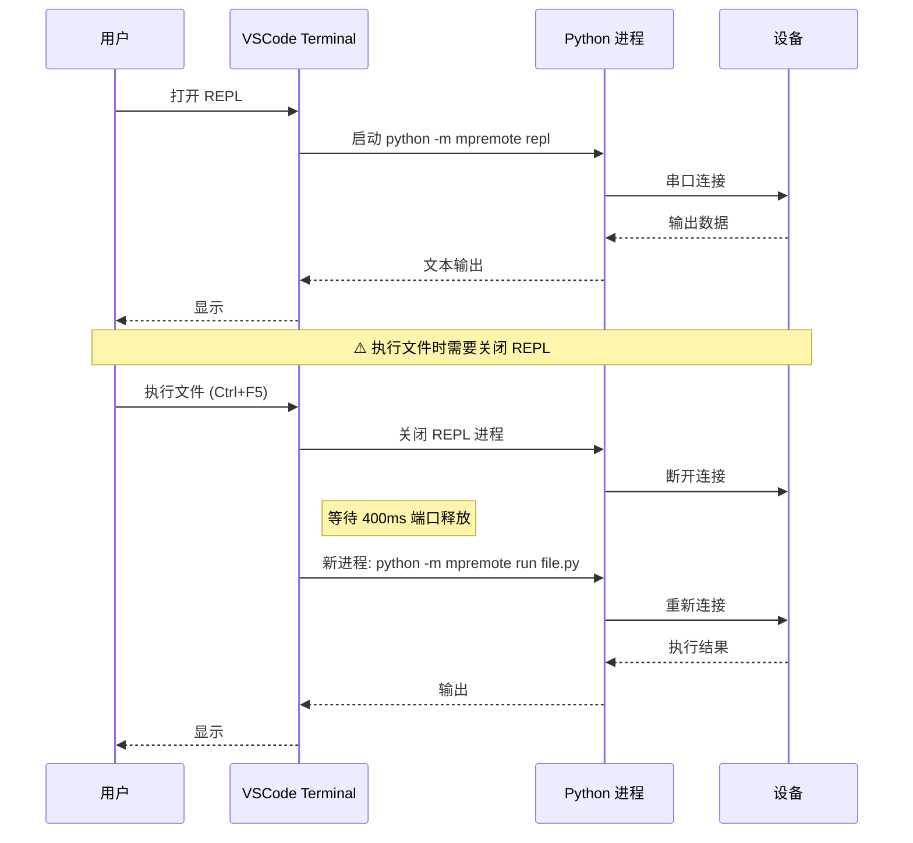
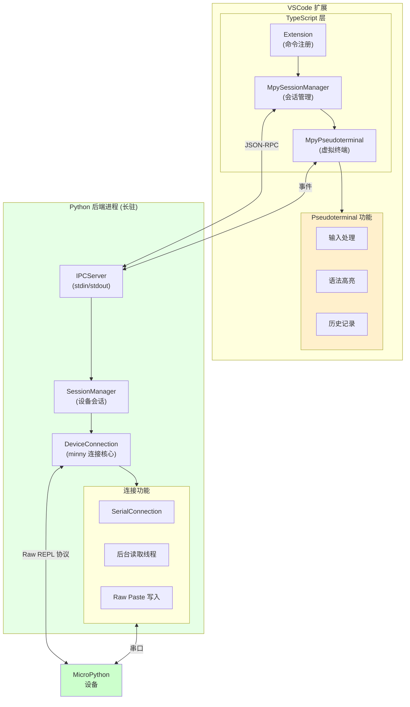
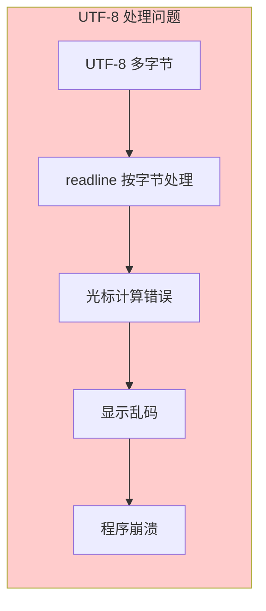
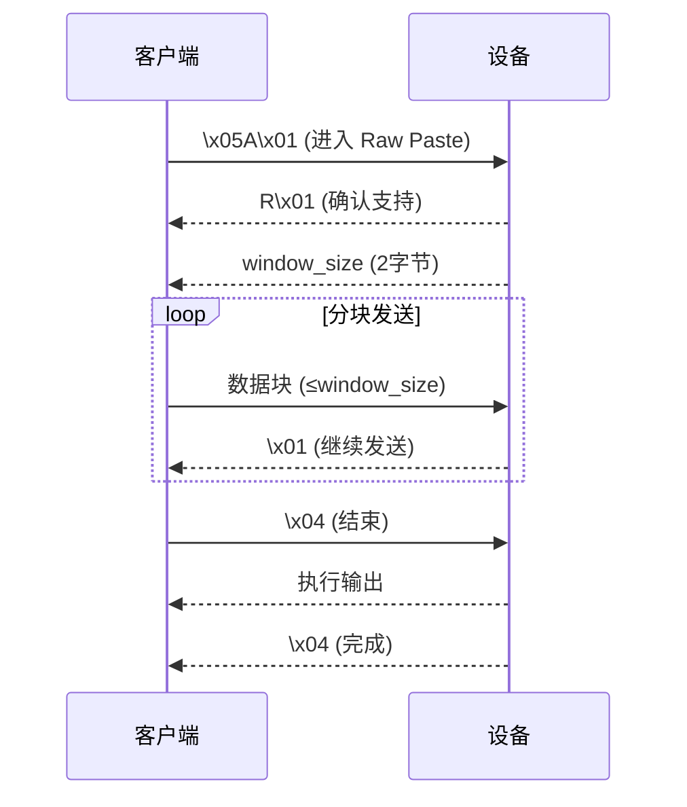
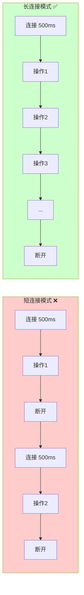
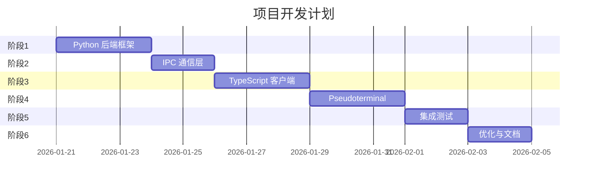
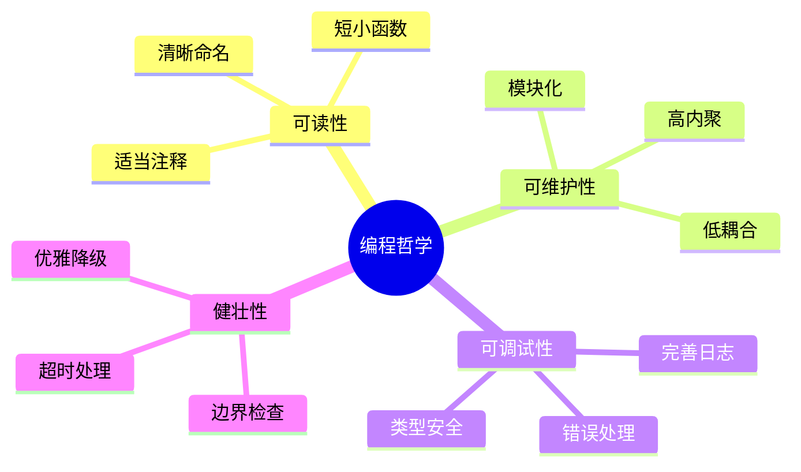
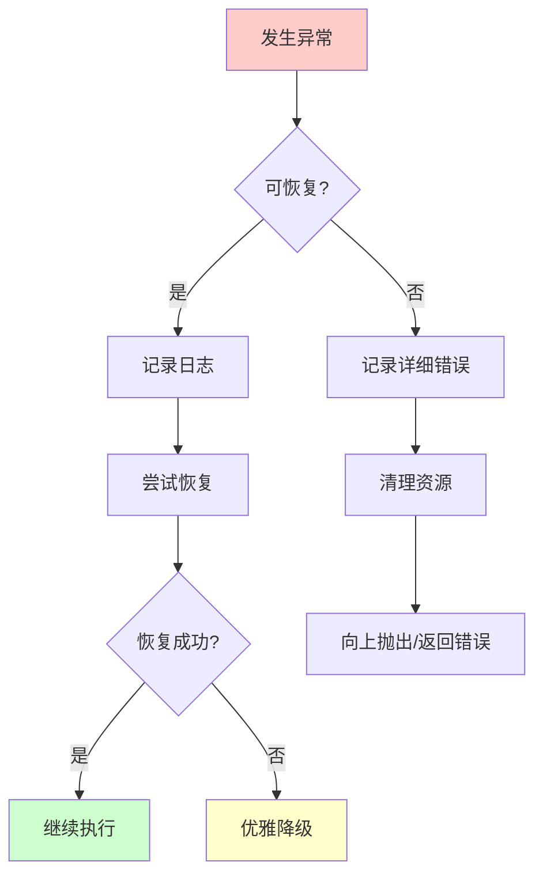
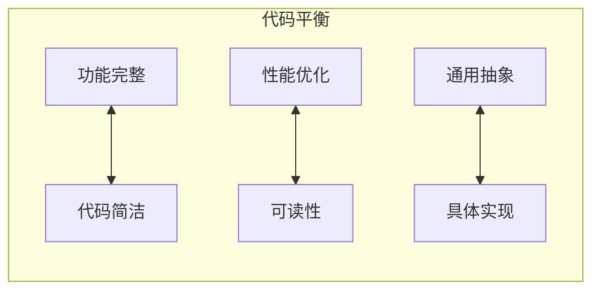

# VScodeMicroPython REPL 架构重构技术方案

## 文档信息

| 项目 | 内容 |
|------|------|
| 版本 | v1.0 |
| 日期 | 2026-01-20 |
| 状态 | 设计阶段 |
| 作者 | - |

---

## 第一部分：现有架构分析

### 1.1 当前架构概览



### 1.2 关键组件及职责

| 组件 | 文件 | 职责 |
|------|------|------|
| 扩展入口 | `src/core/extension.ts` | 初始化、命令注册 |
| REPL 命令 | `src/board/mpremoteCommands.ts` | REPL 打开/关闭、执行文件 |
| 进程管理 | `src/board/MpRemoteManager.ts` | 调用 mpremote CLI |
| mpremote | `src/python/mpremote/` | 内置 mpremote 模块副本 |

### 1.3 当前工作流程



### 1.4 当前架构存在的问题

#### 问题 1：设备端 readline 不支持 UTF-8 输入

**根本原因**：MicroPython 的 `shared/readline/readline.c` 仅接受 ASCII 32-126 字符：

```c
// readline.c:279-285
} else if (32 <= c && c <= 126) {
    // 只接受可打印 ASCII
    vstr_ins_char(rl.line, rl.cursor_pos, c);
    // ...
}
// 其他字符被丢弃！
```

**影响**：
- REPL 无法输入中文变量名
- 无法直接输入中文字符串
- 与现代多语言开发需求不兼容

#### 问题 2：每次操作都启动新进程

**代码证据** (`mpremoteCommands.ts`):
```typescript
// 每次运行都创建新命令
const cmd = await buildShellCommand(["connect", device, "run", filePath]);
terminal.sendText(cmd, true);
```

**影响**：
- 连接开销大（每次 ~500ms）
- 无法维持会话状态
- 设备端变量在会话间丢失

#### 问题 3：REPL 与文件操作串口冲突

**代码证据** (`mpremoteCommands.ts:275-290`):
```typescript
export async function runActiveFile(): Promise<void> {
    if (isReplOpen()) {
        await closeReplTerminal();
        await new Promise(r => setTimeout(r, 400)); // 硬编码等待
    }
    // ... 执行
}
```

**影响**：
- 每次执行都需关闭 REPL
- 用户体验差
- 400ms 等待时间不稳定

#### 问题 4：使用 Terminal API 无法结构化处理输出

**问题描述**：
- VSCode Terminal 只能显示文本，无法捕获输出
- 无法区分 stdout/stderr
- 无法实现代码高亮
- 无法实现自动补全

#### 问题 5：Friendly REPL 模式的局限

**设备端处理**：在 Friendly REPL 模式下，所有编辑功能由设备端 readline 处理

**局限**：
- 无法实现客户端语法高亮
- 无法实现智能补全
- 无法使用自定义按键绑定
- 输入缓冲区大小有限

---

## 第二部分：路线 B+D 混合方案

### 2.1 方案概述

**核心思路**：采用 minny 的连接管理和 Raw Paste 模式核心代码，通过 JSON IPC 与 VSCode Pseudoterminal 前端通信，实现：

1. **长连接**：一次连接，持续使用
2. **客户端编辑**：所有输入编辑在 VSCode 侧完成
3. **Raw Paste 模式**：代码通过二进制协议提交
4. **并行操作**：REPL 和文件操作共享连接

### 2.2 新架构设计



### 2.3 核心组件详细设计

#### 2.3.1 Python 后端 (`mpy_backend`)

**目录结构**：
```
src/python/mpy_backend/
├── __init__.py
├── __main__.py              # 入口点
├── server.py                # IPC 服务器
├── session.py               # 会话管理
├── device/
│   ├── __init__.py
│   ├── connection.py        # 连接抽象 (源自 minny)
│   ├── serial_connection.py # 串口连接 (源自 minny)
│   ├── protocol.py          # Raw/Paste 协议 (源自 minny)
│   └── device_manager.py    # 设备管理器
├── messages/
│   ├── __init__.py
│   ├── commands.py          # 命令定义
│   └── responses.py         # 响应定义
└── utils/
    ├── __init__.py
    └── encoding.py          # 编码工具
```

**核心类设计**：

```python
# server.py
class IPCServer:
    """IPC 服务器，通过 stdin/stdout 与 VSCode 通信"""
    
    def __init__(self) -> None:
        self._session_manager: SessionManager = SessionManager()
        self._running: bool = False
        self._message_handlers: dict[str, Callable] = {}
    
    def start(self) -> None:
        """启动服务器主循环"""
        ...
    
    def stop(self) -> None:
        """停止服务器"""
        ...
    
    def send_message(self, message: ResponseMessage) -> None:
        """发送消息到 VSCode"""
        ...
    
    def _handle_message(self, message: CommandMessage) -> None:
        """处理收到的命令"""
        ...
```

```python
# session.py
class DeviceSession:
    """单个设备会话"""
    
    def __init__(self, port: str, baudrate: int = 115200) -> None:
        self._port: str = port
        self._baudrate: int = baudrate
        self._connection: SerialConnection | None = None
        self._device_manager: DeviceManager | None = None
        self._state: SessionState = SessionState.DISCONNECTED
    
    def connect(self) -> bool:
        """连接到设备"""
        ...
    
    def disconnect(self) -> None:
        """断开连接"""
        ...
    
    def execute_code(self, code: str, 
                     output_callback: Callable[[str, str], None]) -> ExecuteResult:
        """执行代码并流式返回输出"""
        ...
    
    def interrupt(self) -> None:
        """中断执行"""
        ...
    
    def read_file(self, path: str) -> bytes:
        """读取设备文件"""
        ...
    
    def write_file(self, path: str, content: bytes) -> None:
        """写入设备文件"""
        ...
```

```python
# device/protocol.py
class RawPasteProtocol:
    """Raw Paste 模式协议实现"""
    
    # 协议常量
    PASTE_MODE_CMD: bytes = b"\x05"       # Ctrl-E
    RAW_MODE_CMD: bytes = b"\x01"         # Ctrl-A
    NORMAL_MODE_CMD: bytes = b"\x02"      # Ctrl-B
    INTERRUPT_CMD: bytes = b"\x03"        # Ctrl-C
    SOFT_REBOOT_CMD: bytes = b"\x04"      # Ctrl-D
    RAW_PASTE_COMMAND: bytes = b"\x05A\x01"
    EOT: bytes = b"\x04"
    
    def __init__(self, connection: MicroPythonConnection) -> None:
        self._connection: MicroPythonConnection = connection
        self._in_raw_mode: bool = False
    
    def enter_raw_mode(self) -> None:
        """进入 Raw REPL 模式"""
        ...
    
    def exit_raw_mode(self) -> None:
        """退出到 Normal 模式"""
        ...
    
    def submit_code(self, code: str) -> None:
        """通过 Raw Paste 模式提交代码"""
        ...
    
    def read_output_until_prompt(self) -> tuple[str, str]:
        """读取输出直到出现提示符"""
        ...
```

#### 2.3.2 TypeScript 前端

**目录结构**：
```
src/
├── backend/
│   ├── BackendProcess.ts      # 后端进程管理
│   ├── IPCClient.ts           # IPC 客户端
│   └── messages.ts            # 消息类型定义
├── terminal/
│   ├── MpyPseudoterminal.ts   # 虚拟终端实现
│   ├── InputHandler.ts        # 输入处理
│   ├── OutputRenderer.ts      # 输出渲染
│   ├── SyntaxHighlighter.ts   # 语法高亮
│   └── HistoryManager.ts      # 历史记录
├── session/
│   ├── SessionManager.ts      # 会话管理
│   └── DeviceSession.ts       # 设备会话
└── commands/
    └── replCommands.ts        # 命令注册
```

**核心类设计**：

```typescript
// BackendProcess.ts
export class BackendProcess {
    private process: ChildProcess | null = null;
    private ipcClient: IPCClient | null = null;
    
    /**
     * 启动后端进程
     */
    async start(): Promise<void> { ... }
    
    /**
     * 停止后端进程
     */
    async stop(): Promise<void> { ... }
    
    /**
     * 发送命令到后端
     * @param command 命令对象
     * @returns 响应对象
     */
    async sendCommand<T extends Response>(command: Command): Promise<T> { ... }
    
    /**
     * 注册事件监听器
     * @param event 事件类型
     * @param handler 处理函数
     */
    onEvent(event: string, handler: (data: any) => void): void { ... }
}
```

```typescript
// MpyPseudoterminal.ts
export class MpyPseudoterminal implements vscode.Pseudoterminal {
    private writeEmitter = new vscode.EventEmitter<string>();
    private closeEmitter = new vscode.EventEmitter<number>();
    
    onDidWrite: vscode.Event<string> = this.writeEmitter.event;
    onDidClose: vscode.Event<number> = this.closeEmitter.event;
    
    private inputBuffer: string = "";
    private historyManager: HistoryManager;
    private syntaxHighlighter: SyntaxHighlighter;
    
    /**
     * 终端打开时调用
     * @param initialDimensions 终端尺寸
     */
    open(initialDimensions: vscode.TerminalDimensions | undefined): void { ... }
    
    /**
     * 终端关闭时调用
     */
    close(): void { ... }
    
    /**
     * 处理用户输入
     * @param data 用户输入的字符
     */
    handleInput(data: string): void { ... }
    
    /**
     * 显示输出
     * @param text 输出文本
     * @param stream 流类型 (stdout/stderr)
     */
    writeOutput(text: string, stream: "stdout" | "stderr"): void { ... }
}
```

#### 2.3.3 IPC 消息协议

**消息格式**：
```typescript
// 命令消息 (VSCode → Python)
interface CommandMessage {
    id: string;              // 唯一消息 ID
    type: "command";
    command: string;         // 命令名称
    params: Record<string, any>;
}

// 响应消息 (Python → VSCode)
interface ResponseMessage {
    id: string;              // 对应的命令 ID
    type: "response";
    success: boolean;
    data?: any;
    error?: {
        code: string;
        message: string;
    };
}

// 事件消息 (Python → VSCode)
interface EventMessage {
    type: "event";
    event: string;           // 事件名称
    data: any;
}
```

**命令定义**：
```typescript
// 连接管理
type ConnectCommand = { command: "connect"; params: { port: string; baudrate?: number } };
type DisconnectCommand = { command: "disconnect"; params: { port: string } };

// 代码执行
type ExecuteCommand = { command: "execute"; params: { port: string; code: string } };
type InterruptCommand = { command: "interrupt"; params: { port: string } };

// 文件操作
type ReadFileCommand = { command: "readFile"; params: { port: string; path: string } };
type WriteFileCommand = { command: "writeFile"; params: { port: string; path: string; content: string } };
type ListDirCommand = { command: "listDir"; params: { port: string; path: string } };
type DeleteCommand = { command: "delete"; params: { port: string; path: string } };

// 设备信息
type GetDeviceInfoCommand = { command: "getDeviceInfo"; params: { port: string } };
```

**事件定义**：
```typescript
// 输出事件
type OutputEvent = { event: "output"; data: { port: string; text: string; stream: "stdout" | "stderr" } };

// 状态事件
type StateChangedEvent = { event: "stateChanged"; data: { port: string; state: SessionState } };

// 连接事件
type ConnectedEvent = { event: "connected"; data: { port: string; deviceInfo: DeviceInfo } };
type DisconnectedEvent = { event: "disconnected"; data: { port: string; reason: string } };
```

### 2.4 为什么必须这样解决

#### 2.4.1 为什么不能修改设备端 readline

**实验证据**：
```c
// 尝试修改 readline.c 接受 UTF-8
} else if (32 <= c && c <= 126 || c >= 128) {
    vstr_ins_char(rl.line, rl.cursor_pos, c);
    // ...
}
```

**失败原因**：



1. readline 按字节处理，UTF-8 是多字节编码
2. 光标移动计算基于字节而非字符
3. 回显控制与终端协议不兼容
4. 导致显示乱码和程序崩溃

#### 2.4.2 为什么需要客户端编辑

| 对比项 | 设备端编辑 | 客户端编辑 |
|--------|-----------|-----------|
| UTF-8 支持 | ❌ 不支持 | ✅ 原生支持 |
| 语法高亮 | ❌ 不可能 | ✅ 可实现 |
| 自动补全 | ❌ 有限 | ✅ 可扩展 |
| 自定义按键 | ❌ 不可能 | ✅ 完全控制 |
| 历史记录 | ❌ 基础 | ✅ 可持久化 |

#### 2.4.3 为什么需要 Raw Paste 模式

**传统 Raw REPL 模式**：
```
发送: print("hello")\x04
接收: OK
接收: hello\n
接收: \x04  (正常结束)
接收: \x04  (无异常)
接收: >    (提示符)
```

**Raw Paste 模式流程**：



**Raw Paste 模式优势**：
1. **流控制**：窗口机制防止缓冲区溢出
2. **更快**：批量传输，无需逐行确认
3. **可靠**：硬件流控制支持
4. **官方推荐**：MicroPython 官方最佳实践

#### 2.4.4 为什么需要长连接



- 减少连接开销
- 维持会话状态
- 支持并行操作

#### 2.4.5 为什么使用 Pseudoterminal

| 方案 | Terminal API | Pseudoterminal |
|------|-------------|----------------|
| 输入控制 | ❌ 无 | ✅ 完全 |
| 输出捕获 | ❌ 无 | ✅ 完全 |
| 自定义渲染 | ❌ 无 | ✅ 支持 |
| 集成度 | ✅ 高 | ✅ 高 |
| 复杂度 | 低 | 中 |

---

## 第三部分：工作流程与任务分解

### 3.1 开发阶段概览



### 3.2 阶段 1：Python 后端框架 (3天)

#### 任务 1.1：提取 minny 核心代码

**输入**：
- `minny/src/minny/connection.py`
- `minny/src/minny/serial_connection.py`
- `minny/src/minny/target.py`

**输出**：
- `mpy_backend/device/connection.py`
- `mpy_backend/device/serial_connection.py`
- `mpy_backend/device/protocol.py`

**工作内容**：
1. 复制连接基类 `MicroPythonConnection`
2. 复制 `SerialConnection` 实现
3. 提取 `ProperTargetManager` 中的 Raw Paste 协议代码
4. 移除 Thonny 特定依赖
5. 添加类型注解

#### 任务 1.2：实现 IPC 服务器

**输出**：`mpy_backend/server.py`

**工作内容**：
1. 实现 stdin/stdout JSON 消息读写
2. 实现消息分发机制
3. 实现异步事件推送
4. 添加错误处理

#### 任务 1.3：实现会话管理

**输出**：`mpy_backend/session.py`

**工作内容**：
1. 实现 `DeviceSession` 类
2. 实现连接状态机
3. 实现代码执行逻辑
4. 实现文件操作接口

### 3.3 阶段 2：IPC 通信层 (2天)

#### 任务 2.1：定义消息协议

**输出**：
- `mpy_backend/messages/commands.py`
- `mpy_backend/messages/responses.py`
- `src/backend/messages.ts`

**工作内容**：
1. 定义所有命令类型
2. 定义所有响应类型
3. 定义事件类型
4. Python/TypeScript 类型同步

#### 任务 2.2：实现 TypeScript IPC 客户端

**输出**：
- `src/backend/BackendProcess.ts`
- `src/backend/IPCClient.ts`

**工作内容**：
1. 实现后端进程启动/停止
2. 实现消息发送/接收
3. 实现 Promise 化的请求/响应
4. 实现事件监听

### 3.4 阶段 3：TypeScript 客户端 (3天)

#### 任务 3.1：实现会话管理

**输出**：
- `src/session/SessionManager.ts`
- `src/session/DeviceSession.ts`

**工作内容**：
1. 实现设备会话管理
2. 实现连接状态管理
3. 实现多设备支持
4. 集成现有设备发现逻辑

#### 任务 3.2：更新命令注册

**输出**：`src/commands/replCommands.ts` (修改)

**工作内容**：
1. 迁移到新会话架构
2. 更新所有 REPL 命令
3. 保持 API 兼容性

### 3.5 阶段 4：Pseudoterminal 实现 (3天)

#### 任务 4.1：实现虚拟终端

**输出**：`src/terminal/MpyPseudoterminal.ts`

**工作内容**：
1. 实现 `vscode.Pseudoterminal` 接口
2. 实现输入处理逻辑
3. 实现多行编辑
4. 实现 ANSI 转义序列处理

#### 任务 4.2：实现输入处理

**输出**：`src/terminal/InputHandler.ts`

**工作内容**：
1. 实现行编辑 (插入、删除、移动)
2. 实现快捷键处理
3. 实现多行模式检测
4. 实现 UTF-8 输入

#### 任务 4.3：实现历史记录

**输出**：`src/terminal/HistoryManager.ts`

**工作内容**：
1. 实现历史记录存储
2. 实现上下翻页
3. 实现历史搜索
4. 实现持久化

### 3.6 阶段 5：集成测试 (2天)

#### 任务 5.1：单元测试

**工作内容**：
1. Python 后端单元测试
2. TypeScript 客户端单元测试
3. 消息协议测试

#### 任务 5.2：集成测试

**工作内容**：
1. 端到端连接测试
2. REPL 交互测试
3. 文件操作测试
4. 并行操作测试

### 3.7 阶段 6：优化与文档 (2天)

#### 任务 6.1：性能优化

**工作内容**：
1. 减少消息延迟
2. 优化输出渲染
3. 内存使用优化

#### 任务 6.2：文档编写

**工作内容**：
1. API 文档
2. 用户指南
3. 开发者文档

---

## 第四部分：注意事项与风险

### 4.1 技术风险

#### 风险 1：minny 代码兼容性

**描述**：minny 代码可能依赖 Thonny 特定功能

**缓解措施**：
1. 逐模块提取，单独测试
2. 创建兼容层 (adapter)
3. 保持原有接口签名

#### 风险 2：串口资源竞争

**描述**：文件操作和 REPL 可能同时访问串口

**缓解措施**：


```python
class DeviceSession:
    def __init__(self):
        self._command_lock = threading.Lock()
        self._interrupt_event = threading.Event()
    
    def execute_code(self, code: str, callback: Callable) -> ExecuteResult:
        with self._command_lock:
            # 独占执行
            ...
```

#### 风险 3：Windows/Linux/macOS 兼容性

**描述**：串口路径、编码处理可能有平台差异

**缓解措施**：
1. 使用 pyserial 抽象层
2. 统一使用 UTF-8
3. 完整的跨平台测试

### 4.2 注意事项

#### 注意事项 1：后端进程生命周期

```typescript
// 确保后端进程正确清理
class BackendProcess {
    async start(): Promise<void> {
        // 注册清理钩子
        vscode.workspace.onDidCloseTextDocument(() => this.cleanup());
        process.on('exit', () => this.cleanup());
    }
    
    private cleanup(): void {
        if (this.process) {
            this.process.kill();
        }
    }
}
```

#### 注意事项 2：消息序列化

```python
# 确保所有消息可序列化
def serialize_message(msg: dict) -> str:
    def default_serializer(obj):
        if isinstance(obj, bytes):
            return obj.hex()
        if isinstance(obj, Exception):
            return str(obj)
        raise TypeError(f"无法序列化: {type(obj)}")
    
    return json.dumps(msg, default=default_serializer, ensure_ascii=False)
```

#### 注意事项 3：UTF-8 边界处理

```python
# 串口读取时处理 UTF-8 多字节边界
def _listen_serial(self):
    while not self._stopped:
        data = self._serial.read(256)
        
        # 检查是否在 UTF-8 多字节序列中间
        if data and not self._is_valid_utf8_end(data):
            # 读取更多字节完成序列
            remaining = self._serial.read(3)  # UTF-8 最多 4 字节
            data += remaining
        
        self._queue.put(data)
```

#### 注意事项 4：超时处理

```python
# 所有 IO 操作必须有超时
DEFAULT_TIMEOUT = 10.0

def read_until_prompt(self, timeout: float = DEFAULT_TIMEOUT) -> str:
    """读取直到提示符
    
    :param timeout: float: 超时时间(秒)
    :return: str: 读取的内容
    :raises TimeoutError: 超时时抛出
    """
    start = time.monotonic()
    while time.monotonic() - start < timeout:
        # ...
    raise TimeoutError("等待提示符超时")
```

### 4.3 兼容性保障

#### 保持向后兼容

```typescript
// 保持现有命令 ID 不变
export function registerCommands(context: vscode.ExtensionContext): void {
    // 现有命令继续工作
    context.subscriptions.push(
        vscode.commands.registerCommand('micropython.repl.open', openReplTerminal),
        vscode.commands.registerCommand('micropython.repl.close', closeReplTerminal),
        // ...
    );
}
```

#### mpremote CLI 保持可用

```typescript
// 新架构下仍可调用 mpremote CLI
class MpRemoteManager {
    // 保留原有 CLI 调用方式作为回退
    async runCli(args: string[]): Promise<RunResult> { ... }
}
```

---

## 第五部分：编程规范与哲学

### 5.1 核心编程哲学



### 5.2 代码组织原则

#### 5.2.1 模块职责单一

```python
# ✅ 正确：每个模块职责明确
# connection.py - 只负责连接抽象
# protocol.py   - 只负责协议实现
# session.py    - 只负责会话管理

# ❌ 错误：一个模块包含多种职责
# device.py - 连接 + 协议 + 会话 + 文件操作
```

#### 5.2.2 函数长度控制

```python
# ✅ 正确：函数长度控制在 30 行以内
def execute_code(self, code: str) -> ExecuteResult:
    """执行代码"""
    self._validate_connection()
    self._enter_raw_mode()
    self._submit_code(code)
    return self._capture_output()

# ❌ 错误：超长函数
def execute_code(self, code: str) -> ExecuteResult:
    # 200 行代码...
```

#### 5.2.3 提前返回原则

```python
# ✅ 正确：条件不满足时提前返回
def connect(self, port: str) -> bool:
    """连接到设备
    
    :param port: str: 串口路径
    :return: bool: 是否连接成功
    """
    if not port:
        return False
    
    if self._is_connected:
        return True
    
    if not self._validate_port(port):
        return False
    
    # 主逻辑
    self._connection = SerialConnection(port)
    return True

# ❌ 错误：深层嵌套
def connect(self, port: str) -> bool:
    if port:
        if not self._is_connected:
            if self._validate_port(port):
                # 主逻辑
                self._connection = SerialConnection(port)
                return True
            else:
                return False
        else:
            return True
    else:
        return False
```

#### 5.2.4 循环中的提前退出

```python
# ✅ 正确：使用 continue 减少嵌套
def process_items(self, items: list[Item]) -> list[Result]:
    """处理项目列表
    
    :param items: list[Item]: 项目列表
    :return: list[Result]: 处理结果
    """
    results = []
    for item in items:
        # 不符合条件，跳过
        if not item.is_valid:
            continue
        
        if item.is_skipped:
            continue
        
        # 主逻辑，无嵌套
        result = self._process_single(item)
        results.append(result)
    
    return results

# ❌ 错误：深层嵌套
def process_items(self, items: list[Item]) -> list[Result]:
    results = []
    for item in items:
        if item.is_valid:
            if not item.is_skipped:
                # 嵌套过深
                result = self._process_single(item)
                results.append(result)
    return results
```

### 5.3 类型注解规范

#### 5.3.1 Python 类型注解

```python
from typing import Optional, Callable, Any
from dataclasses import dataclass

@dataclass
class ExecuteResult:
    """代码执行结果"""
    success: bool
    stdout: str
    stderr: str
    exception: Optional[str] = None

class DeviceSession:
    """设备会话管理器"""
    
    def __init__(self, port: str, baudrate: int = 115200) -> None:
        """初始化会话
        
        :param port: str: 串口路径 (如 COM3 或 /dev/ttyUSB0)
        :param baudrate: int: 波特率，默认 115200
        """
        self._port: str = port
        self._baudrate: int = baudrate
        self._connection: Optional[SerialConnection] = None
    
    def execute_code(
        self,
        code: str,
        output_callback: Optional[Callable[[str, str], None]] = None,
        timeout: float = 30.0
    ) -> ExecuteResult:
        """执行代码
        
        :param code: str: 要执行的 Python 代码
        :param output_callback: Callable[[str, str], None]: 输出回调函数
            第一个参数为输出文本，第二个参数为流类型 ("stdout" 或 "stderr")
        :param timeout: float: 执行超时时间(秒)
        :return: ExecuteResult: 执行结果
        :raises ConnectionError: 未连接时抛出
        :raises TimeoutError: 执行超时时抛出
        """
        ...
```

#### 5.3.2 VSCode 风格文档字符串

```python
def cancel_call(task_id: int) -> bool:
    '''取消延时/循环任务

    :param task_id: int: 任务ID
    :return: bool: 是否取消成功
    '''
    pass

def read_file(
    self, 
    path: str, 
    encoding: str = "utf-8",
    chunk_size: int = 1024
) -> str:
    '''读取设备文件内容

    :param path: str: 文件路径 (如 /main.py)
    :param encoding: str: 文件编码，默认 utf-8
    :param chunk_size: int: 分块读取大小，默认 1024 字节
    :return: str: 文件内容
    :raises FileNotFoundError: 文件不存在时抛出
    :raises IOError: 读取失败时抛出
    '''
    pass
```

#### 5.3.3 TypeScript 类型注解

```typescript
/**
 * 设备会话状态
 */
export enum SessionState {
    DISCONNECTED = "disconnected",
    CONNECTING = "connecting",
    CONNECTED = "connected",
    EXECUTING = "executing",
    ERROR = "error"
}

/**
 * 执行结果
 */
export interface ExecuteResult {
    /** 是否成功 */
    success: boolean;
    /** 标准输出 */
    stdout: string;
    /** 标准错误 */
    stderr: string;
    /** 异常信息 */
    exception?: string;
}

/**
 * 设备会话接口
 */
export interface IDeviceSession {
    /** 当前状态 */
    readonly state: SessionState;
    /** 串口路径 */
    readonly port: string;
    
    /**
     * 连接到设备
     * @returns 是否连接成功
     */
    connect(): Promise<boolean>;
    
    /**
     * 执行代码
     * @param code 要执行的 Python 代码
     * @param options 执行选项
     * @returns 执行结果
     */
    executeCode(code: string, options?: ExecuteOptions): Promise<ExecuteResult>;
}
```

### 5.4 数据传递规范

#### 5.4.1 使用数据类替代字典

```python
# ✅ 正确：使用数据类
@dataclass
class DeviceInfo:
    """设备信息"""
    port: str
    baudrate: int
    device_name: str
    micropython_version: str
    unique_id: str

def get_device_info(self) -> DeviceInfo:
    """获取设备信息
    
    :return: DeviceInfo: 设备信息对象
    """
    return DeviceInfo(
        port=self._port,
        baudrate=self._baudrate,
        device_name=self._query("sys.platform"),
        micropython_version=self._query("sys.version"),
        unique_id=self._query("machine.unique_id().hex()")
    )

# ❌ 错误：使用字典
def get_device_info(self) -> dict:
    return {
        "port": self._port,           # 字符串键，无类型提示
        "baudrate": self._baudrate,   # 容易拼写错误
        "device_name": "...",
    }
```

#### 5.4.2 TypeScript 使用接口/类型

```typescript
// ✅ 正确：使用接口定义
interface DeviceInfo {
    port: string;
    baudrate: number;
    deviceName: string;
    micropythonVersion: string;
    uniqueId: string;
}

function getDeviceInfo(): DeviceInfo {
    return {
        port: this.port,
        baudrate: this.baudrate,
        deviceName: this.queryDevice("sys.platform"),
        micropythonVersion: this.queryDevice("sys.version"),
        uniqueId: this.queryDevice("machine.unique_id().hex()")
    };
}

// ❌ 错误：使用 any 或 Record<string, any>
function getDeviceInfo(): Record<string, any> {
    return { /* 无类型检查 */ };
}
```

### 5.5 错误处理规范

#### 5.5.1 定义明确的异常层次

```python
# 定义异常层次
class MpyBackendError(Exception):
    """后端基础异常"""
    pass

class ConnectionError(MpyBackendError):
    """连接相关异常"""
    pass

class ProtocolError(MpyBackendError):
    """协议相关异常"""
    pass

class TimeoutError(MpyBackendError):
    """超时异常"""
    pass

class DeviceError(MpyBackendError):
    """设备端异常"""
    def __init__(self, message: str, traceback: str = ""):
        super().__init__(message)
        self.traceback = traceback
```

#### 5.5.2 优雅的错误处理

```python
# ✅ 正确：捕获具体异常，记录日志，返回有意义的错误
def connect(self) -> bool:
    """连接到设备
    
    :return: bool: 是否连接成功
    """
    try:
        self._connection = SerialConnection(self._port, self._baudrate)
        self._enter_raw_mode()
        return True
    except serial.SerialException as e:
        logger.error(f"串口打开失败: {self._port}, 错误: {e}")
        return False
    except ProtocolError as e:
        logger.error(f"协议错误: {e}")
        self._connection.close()
        self._connection = None
        return False

# ❌ 错误：捕获所有异常，静默失败
def connect(self) -> bool:
    try:
        self._connection = SerialConnection(self._port)
        return True
    except:  # 捕获所有异常
        return False  # 不知道失败原因
```

#### 5.5.3 错误处理决策流程



### 5.6 日志规范

```python
import logging

# 配置模块日志器
logger = logging.getLogger(__name__)

class DeviceSession:
    def connect(self) -> bool:
        """连接到设备
        
        :return: bool: 是否连接成功
        """
        logger.info(f"连接设备: {self._port}")
        
        try:
            self._connection = SerialConnection(self._port)
            logger.debug(f"串口已打开: {self._port}")
            
            self._enter_raw_mode()
            logger.debug("已进入 Raw REPL 模式")
            
            logger.info(f"设备连接成功: {self._port}")
            return True
            
        except Exception as e:
            logger.error(f"连接失败: {self._port}, 错误: {e}", exc_info=True)
            return False
```

**日志级别使用规范**：

| 级别 | 使用场景 |
|------|----------|
| DEBUG | 详细调试信息，如协议字节、状态转换 |
| INFO | 重要操作，如连接、断开、执行开始/完成 |
| WARNING | 非致命问题，如超时重试、降级处理 |
| ERROR | 错误但程序可继续，如连接失败 |
| CRITICAL | 严重错误，程序可能需要终止 |

### 5.7 测试规范

#### 5.7.1 单元测试

```python
# test_protocol.py
import pytest
from mpy_backend.device.protocol import RawPasteProtocol

class TestRawPasteProtocol:
    """Raw Paste 协议测试"""
    
    def test_enter_raw_mode(self, mock_connection):
        """测试进入 Raw 模式"""
        protocol = RawPasteProtocol(mock_connection)
        protocol.enter_raw_mode()
        
        # 验证发送了正确的控制字符
        mock_connection.write.assert_called_with(b"\x01")
    
    def test_submit_code_success(self, mock_connection):
        """测试成功提交代码"""
        mock_connection.soft_read.return_value = b"R\x01"
        
        protocol = RawPasteProtocol(mock_connection)
        protocol.submit_code("print('hello')")
        
        # 验证使用了 Raw Paste 命令
        assert b"\x05A\x01" in mock_connection.write.call_args_list[0][0][0]
```

#### 5.7.2 集成测试

```typescript
// integration.test.ts
import { BackendProcess } from "../src/backend/BackendProcess";

describe("Backend Integration", () => {
    let backend: BackendProcess;
    
    beforeEach(async () => {
        backend = new BackendProcess();
        await backend.start();
    });
    
    afterEach(async () => {
        await backend.stop();
    });
    
    it("should connect to device", async () => {
        const result = await backend.sendCommand({
            id: "test-1",
            type: "command",
            command: "connect",
            params: { port: "COM3" }
        });
        
        expect(result.success).toBe(true);
    });
});
```

### 5.8 代码审查清单

#### 提交前检查

- [ ] 所有函数都有类型注解
- [ ] 所有公开函数都有 VSCode 风格文档字符串
- [ ] 没有超过 30 行的函数
- [ ] 没有超过 3 层的嵌套
- [ ] 使用数据类而非字典传递数据
- [ ] 所有异常都有适当处理
- [ ] 没有静态分析警告（pyright/pylint/ESLint）
- [ ] 添加了必要的单元测试
- [ ] 日志信息充分但不过度
- [ ] 使用提前返回/continue 减少嵌套

#### 代码风格

```python
# Python: 使用 black + isort + pylint
# 配置文件: pyproject.toml
[tool.black]
line-length = 100

[tool.isort]
profile = "black"
line_length = 100

[tool.pylint.messages_control]
disable = ["C0114", "C0115", "C0116"]  # 允许缺少模块/类/函数文档
```

```javascript
// TypeScript: 使用 ESLint + Prettier
// 配置文件: .eslintrc.json
{
    "extends": ["eslint:recommended", "plugin:@typescript-eslint/recommended"],
    "rules": {
        "@typescript-eslint/explicit-function-return-type": "error",
        "@typescript-eslint/no-explicit-any": "error"
    }
}
```

### 5.9 代码平衡哲学



**原则**：
1. **够用就好**：不过度设计，不提前优化
2. **简单优先**：能用简单方案解决就不用复杂方案
3. **渐进增强**：先实现核心功能，再逐步添加
4. **保持一致**：整个项目使用统一的风格和模式

---

## 第六部分：验收标准

### 6.1 功能验收

| 功能 | 验收标准 |
|------|----------|
| REPL 连接 | 连接成功率 > 99%，连接时间 < 2s |
| 中文输入 | 支持 Unicode 输入，正确显示和执行 |
| 代码执行 | 支持多行代码，正确返回输出 |
| 文件操作 | REPL 不关闭情况下执行文件操作 |
| 中断 | Ctrl+C 能在 500ms 内中断执行 |
| 语法高亮 | 关键字、字符串、注释正确高亮 |
| 历史记录 | 上下键翻页，跨会话持久化 |

### 6.2 性能验收

| 指标 | 标准 |
|------|------|
| 首次连接时间 | < 2s |
| 代码执行延迟 | < 100ms (不含实际执行时间) |
| 输出显示延迟 | < 50ms |
| 内存占用增量 | < 50MB |
| CPU 空闲时占用 | < 1% |

### 6.3 兼容性验收

| 平台/设备 | 验收标准 |
|-----------|----------|
| Windows 10/11 | 全功能支持 |
| macOS 12+ | 全功能支持 |
| Linux (Ubuntu 20.04+) | 全功能支持 |
| ESP32 | 全功能支持 |
| RP2040 | 全功能支持 |
| STM32 | 基础功能支持 |

---

## 附录

### A. 参考资料

1. [MicroPython Raw REPL 协议](https://docs.micropython.org/en/latest/reference/repl.html)
2. [VSCode Pseudoterminal API](https://code.visualstudio.com/api/references/vscode-api#Pseudoterminal)
3. [minny 源码](https://github.com/thonny/minny)
4. [Thonny MicroPython 后端](https://github.com/thonny/thonny/tree/master/thonny/plugins/micropython)

### B. 术语表

| 术语 | 说明 |
|------|------|
| Raw REPL | MicroPython 原始 REPL 模式，用于程序化代码提交 |
| Raw Paste | 带流控制的 Raw REPL 扩展，支持大块代码传输 |
| Pseudoterminal | VSCode 虚拟终端，允许完全控制输入输出 |
| IPC | 进程间通信 (Inter-Process Communication) |
| minny | Thonny 的轻量级 MicroPython 目标管理库 |

### C. 文件变更清单

#### 新增文件

```
src/python/mpy_backend/
├── __init__.py
├── __main__.py
├── server.py
├── session.py
├── device/
│   ├── __init__.py
│   ├── connection.py
│   ├── serial_connection.py
│   ├── protocol.py
│   └── device_manager.py
├── messages/
│   ├── __init__.py
│   ├── commands.py
│   └── responses.py
└── utils/
    ├── __init__.py
    └── encoding.py

src/backend/
├── BackendProcess.ts
├── IPCClient.ts
└── messages.ts

src/terminal/
├── MpyPseudoterminal.ts
├── InputHandler.ts
├── OutputRenderer.ts
├── SyntaxHighlighter.ts
└── HistoryManager.ts

src/session/
├── SessionManager.ts
└── DeviceSession.ts
```

#### 修改文件

```
src/commands/replCommands.ts  - 迁移到新架构
src/core/extension.ts         - 注册新组件
package.json                   - 添加依赖
```
