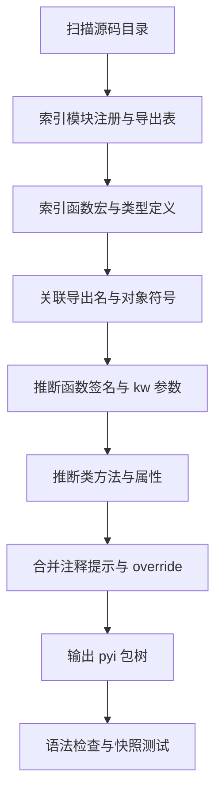

# MicroPython 用户 C 模块转 pyi 工具实施方案

## 1. 目标设定

### 1.1 主目标

实现一个面向 MicroPython 用户 C 模块的静态分析工具，从模块源代码中提取模块、类、函数、方法、属性与参数信息，自动生成可维护的 `.pyi` 文件树，减少手工维护成本。

### 1.2 子目标

1. 支持 USER_C_MODULES 风格模块的模块级导出分析。
2. 支持 `MP_DEFINE_CONST_FUN_OBJ_*` 宏对应的函数/方法签名恢复。
3. 支持通过 `mp_arg_t` / `allowed_args` 提取关键字参数、默认值和必填参数信息。
4. 支持 `MP_DEFINE_CONST_OBJ_TYPE`、`locals_dict`、`attr` 分析类、方法与属性。
5. 支持将源码分析结果输出为标准包树和 `.pyi` 文件。
6. 支持人工覆盖层，允许在自动生成基础上修正少量复杂或歧义签名。

### 1.3 成功标准

1. 对当前已分析的 camera、sh8601、ulab 风格模块，能生成结构正确的 `.pyi` 初稿。
2. 对常见函数可恢复位置参数个数、可选参数区间、关键字参数及默认值。
3. 生成结果可通过类型检查工具和编辑器语法检查。
4. 人工维护量从“逐函数手写”降为“少量 override 修补”。

## 2. 现有参考

### 2.1 可直接参考的事实

1. MicroPython 用户模块一般通过 `MP_REGISTER_MODULE` 注册。
2. 模块导出通常由 `mp_rom_map_elem_t` 的 `module_globals_table` 或 `locals_dict_table` 决定。
3. 函数常见导出方式是 `MP_DEFINE_CONST_FUN_OBJ_0/1/2/3/VAR/VAR_BETWEEN/KW`。
4. 类常见导出方式是 `MP_DEFINE_CONST_OBJ_TYPE`，再配合 `locals_dict` 与 `attr` 逻辑定义方法和属性。
5. 关键字参数通常通过 `mp_arg_t allowed_args[]` 与 `mp_arg_parse_all*` 解析。
6. 某些项目存在 `//|` 风格的注释签名，可作为增强信息源，但不能假设所有项目都有。

### 2.2 现成工具调研结论

1. 没有发现成熟、通用、可直接复用的“MicroPython C 模块转 pyi”开源工具。
2. `micropython-stubber` 更偏运行时导出，不适合作为高精度源码签名恢复核心。
3. `mypy stubgen`、`pybind11-stubgen`、`nanobind` 相关方案都依赖 CPython 可导入模块或框架自带元数据，不适合直接解析 MicroPython 用户 C 模块。
4. `micropython-stubs` 中有 ulab 源码直出 stub 的线索，但更像一次性脚本思路，而不是通用产品化工具。

### 2.3 现有参考项目的作用

1. 当前手工生成的 pyi 可作为验收基线。
2. `micropython-stubs` 可参考其目录输出形式、命名习惯、后处理策略。
3. 当前仓库的 MicroPython 代码补全逻辑，可在后续接入时复用 stub 目录管理经验。

## 3. 需求分析

### 3.1 本轮明确范围

本工具第一阶段只支持以下输入范围：

1. MicroPython 用户 C 模块源码。
2. 典型 USER_C_MODULES / firmware 集成模块组织方式。
3. 单个仓库中的 `.c` / `.h` / 可选 `.cpp` 文件。
4. 不要求在 CPython 中可导入。

### 3.2 暂不纳入第一阶段的范围

1. 通用 CPython 扩展模块。
2. 全量 natmod / `.mpy` 二进制逆向。
3. 任意复杂宏展开后的完整 C 语义恢复。
4. 通过运行时连接开发板做签名提取。

### 3.3 仍需确认的信息

后续真正编码前建议与用户确认：

1. 工具是做成独立 CLI，还是集成到现有扩展仓库脚本中。
2. 输出目标是单仓库定制，还是通用开源工具。
3. 是否需要支持按板级宏裁剪导出结果。
4. 是否要求兼容 C++ 风格模块源文件。

## 4. 架构设计

### 4.1 总体思路

采用“静态扫描 + 规则推断 + 可选增强 + pyi 发射”的分层结构，而不是依赖运行时导入。

整体流程：

1. 发现源文件。
2. 收集宏定义、模块注册、globals/locals 表、类型定义。
3. 建立符号图谱，关联导出名与底层对象定义。
4. 推断函数、方法、属性和参数信息。
5. 合并增强信息与人工 override。
6. 发射 `.pyi` 包树。
7. 运行语法检查和快照测试。

### 4.2 推荐目录结构

若按用户当前偏好落地，建议先采用“独立工具目录”方式，而不是直接塞入现有扩展主源码。推荐两种落点：

1. 同仓库独立目录，例如 `tools/micropython-cmodule-pyi/`。
2. 单独仓库，后续通过脚本或文档与现有扩展联动。

第一阶段更推荐“同仓库独立目录”，原因是：

1. 便于直接复用当前仓库中的验证样本和既有生成结果。
2. 不会把实验性解析逻辑混入扩展运行时代码。
3. 后续若成熟，再抽到独立仓库的迁移成本较低。

```text
micropython-cmodule-pyi/
  src/
    mpy_pyi/
      cli.py
      config.py
      models/
        symbols.py
        signatures.py
        overrides.py
      discover/
        file_discovery.py
        preprocess.py
      parse/
        token_scan.py
        macro_index.py
        table_parser.py
        type_parser.py
      infer/
        module_infer.py
        function_infer.py
        kwargs_infer.py
        property_infer.py
        type_map.py
      emit/
        package_layout.py
        pyi_writer.py
      merge/
        comment_hints.py
        override_loader.py
      validate/
        syntax_check.py
        snapshot.py
  tests/
    fixtures/
    snapshots/
    test_scan.py
    test_infer.py
    test_emit.py
  overrides/
  README.md
```

### 4.3 核心模块职责

#### 4.3.1 discover 层

职责：

1. 遍历输入目录，找出候选 `.c` / `.h` / `.cpp` 文件。
2. 过滤构建目录、第三方无关目录和生成文件。
3. 为解析层提供统一文件内容与位置信息。

#### 4.3.2 parse 层

职责：

1. 建立轻量符号索引，而不是完整 C 编译器前端。
2. 识别以下结构：
   - `MP_REGISTER_MODULE`
   - `MP_DEFINE_CONST_FUN_OBJ_*`
   - `MP_DEFINE_CONST_OBJ_TYPE`
   - `MP_DEFINE_CONST_DICT`
   - `mp_rom_map_elem_t []`
   - `mp_arg_t []`
   - `mp_obj_type_t` / type 定义
3. 记录符号间引用关系。

#### 4.3.3 infer 层

职责：

1. 把“宏和表”转成“模块 API 模型”。
2. 推断函数、方法、静态方法、构造器、属性。
3. 从 `mp_arg_t` 恢复 kw 参数、默认值、必填参数。
4. 对无法确定类型的参数保守回退为 `Any` 或宽类型。

#### 4.3.4 merge 层

职责：

1. 合并源码中的 `//|` 注释提示。
2. 合并用户自定义 override 文件。
3. 允许对已知复杂模块做少量规则修补。

#### 4.3.5 emit 层

职责：

1. 按模块路径输出 `.pyi` 文件树。
2. 正确输出 `__init__.pyi`、子模块目录和类型别名。
3. 保持生成结果稳定，便于 diff 和快照测试。

#### 4.3.6 validate 层

职责：

1. 对生成结果做语法检查。
2. 对固定夹具做 snapshot 测试。
3. 对关键仓库做端到端回归验证。

## 5. 数据模型设计

按要求避免大量使用裸字典，统一使用类或数据类表示中间结构。

### 5.1 建议核心类

```python
@dataclass
class SourceFile:
    path: Path
    text: str

@dataclass
class ModuleExport:
    module_name: str
    symbol_name: str
    globals_symbol: str

@dataclass
class FunctionBinding:
    export_name: str
    object_symbol: str
    c_function_name: str | None
    kind: Literal["function", "method", "classmethod", "staticmethod"]
    min_positional: int | None
    max_positional: int | None
    supports_keywords: bool
    keyword_spec: list[KeywordArgSpec]

@dataclass
class KeywordArgSpec:
    name: str
    required: bool
    default_repr: str | None
    inferred_type: str | None

@dataclass
class TypeBinding:
    type_name: str
    constructor_symbol: str | None
    locals_dict_symbol: str | None
    attr_handler_symbol: str | None
    methods: list[FunctionBinding]
    properties: list[PropertyBinding]

@dataclass
class PropertyBinding:
    name: str
    readable: bool
    writable: bool
    inferred_type: str | None
```

### 5.2 设计原则

1. 原始扫描结果与推断结果分层，避免解析阶段直接拼接最终字符串。
2. 所有跨阶段对象都应带来源位置，便于调试和 override。
3. 对不确定信息显式标注“unknown”，不要伪装成确定结论。

## 6. 核心实现内容

### 6.1 模块发现

实现要点：

1. 查找 `MP_REGISTER_MODULE(name, globals, enabled_macro)`。
2. 提取 `module_name` 与 `globals` 符号。
3. 如未发现注册宏，也允许通过显式传参指定入口 globals 符号，便于处理非标准组织方式。

伪代码：

```python
for file in source_files:
    for match in scan_register_module(file.text):
        modules.append(
            ModuleExport(
                module_name=match.module_qstr_name,
                symbol_name=match.register_symbol,
                globals_symbol=match.globals_symbol,
            )
        )
```

### 6.2 导出表解析

实现要点：

1. 识别 `mp_rom_map_elem_t module_globals_table[]`。
2. 解析形如 `{ MP_ROM_QSTR(MP_QSTR_xxx), MP_ROM_PTR(&xxx_obj) }` 的映射。
3. 保留导出名与对象符号的对应关系。
4. 同样处理 `locals_dict_table`。

伪代码：

```python
for table in scan_rom_tables(file.text):
    for item in table.items:
        export_name = normalize_qstr(item.qstr_name)
        object_symbol = normalize_ptr(item.ptr_symbol)
        symbol_index.add_export(table.name, export_name, object_symbol)
```

### 6.3 函数签名恢复

实现要点：

1. `MP_DEFINE_CONST_FUN_OBJ_0/1/2/3` 可直接映射固定位置参数个数。
2. `VAR` / `VAR_BETWEEN` 可恢复最小和最大位置参数个数。
3. `KW` 需继续关联对应 C 函数和 `allowed_args`。
4. 若只知道参数个数，不知道参数名，则先生成 `arg0`、`arg1` 等占位名，后续由增强层或 override 修正。

伪代码：

```python
def infer_fun_macro(binding_macro: MacroMatch) -> FunctionBinding:
    if binding_macro.kind == "FUN_OBJ_2":
        return FunctionBinding(min_positional=2, max_positional=2, supports_keywords=False, ...)
    if binding_macro.kind == "FUN_OBJ_VAR_BETWEEN":
        return FunctionBinding(min_positional=binding_macro.min_args, max_positional=binding_macro.max_args, supports_keywords=False, ...)
    if binding_macro.kind == "FUN_OBJ_KW":
        return FunctionBinding(min_positional=binding_macro.min_args, max_positional=None, supports_keywords=True, ...)
```

### 6.4 关键字参数恢复

实现要点：

1. 找到 `mp_arg_t allowed_args[]`。
2. 读取 `MP_QSTR_xxx` 得到参数名。
3. 从 flag 中判断 `MP_ARG_REQUIRED`、`MP_ARG_KW_ONLY`、`MP_ARG_OBJ`、`MP_ARG_INT` 等。
4. 从默认值字段推断默认值表示。
5. 把类型映射到 Python stub 类型，例如 `MP_ARG_BOOL -> bool`，`MP_ARG_INT -> int`，`MP_ARG_OBJ -> Any` 或更宽对象类型。

伪代码：

```python
for arg in parse_mp_args_array(array_text):
    spec = KeywordArgSpec(
        name=normalize_qstr(arg.qstr_name),
        required=arg.flags.required,
        default_repr=render_default(arg.default_value),
        inferred_type=map_mp_arg_type(arg.flags),
    )
    keyword_specs.append(spec)
```

### 6.5 类、方法与属性恢复

实现要点：

1. 从 `MP_DEFINE_CONST_OBJ_TYPE` 提取类型名、构造器、locals dict。
2. 从 `locals_dict` 中提取方法和类级属性。
3. 若存在 `attr` 处理函数，扫描其中对 `MP_QSTR_xxx` 的分支，识别可读/可写属性。
4. 对 `__enter__`、`__exit__`、`__iter__`、`__next__` 等特殊方法保留 Python 魔术方法命名。

伪代码：

```python
for branch in scan_attr_handler(attr_handler_text):
    if branch.matches_load_attr and branch.qstr_name:
        properties.add_readable(branch.qstr_name)
    if branch.matches_store_attr and branch.qstr_name:
        properties.add_writable(branch.qstr_name)
```

### 6.6 类型映射策略

建议使用保守映射，避免虚构精确类型。

基础映射：

1. `MP_ARG_BOOL -> bool`
2. `MP_ARG_INT -> int`
3. `MP_ARG_OBJ -> Any`
4. `mp_obj_t -> Any`
5. 字节缓冲场景若能识别 `mp_buffer_info_t`，可映射为 `bytes | bytearray | memoryview`
6. 若识别返回 `mp_const_none`，返回类型可收窄为 `None`

### 6.7 override 机制

第一版必须保留 override 层，否则复杂场景会被边角问题拖慢整体交付。

建议：

1. override 文件采用 YAML 或 TOML。
2. 以“模块名 + 类名 + 成员名”为定位键。
3. 支持覆盖参数名、类型、返回值、文档字符串、是否 property。

示例：

```yaml
modules:
  camera:
    members:
      capture:
        return: memoryview | None
```

## 7. 具体工作流程



## 8. 阶段任务拆分

### 阶段一：MVP 扫描与发射

目标：支持模块级函数与基础类方法。

任务：

1. 完成文件发现与基础文本扫描。
2. 实现 `MP_REGISTER_MODULE` 与 globals/locals table 解析。
3. 实现 `MP_DEFINE_CONST_FUN_OBJ_*` 签名推断。
4. 生成可用的 `.pyi` 初稿。
5. 对 camera、sh8601 做第一轮回归。

验收：

1. 能生成模块、函数、基础类结构。
2. 输出文件无语法错误。

### 阶段二：kw 参数与属性增强

目标：提升生成精度。

任务：

1. 实现 `mp_arg_t` 关键字参数解析。
2. 实现 `MP_DEFINE_CONST_OBJ_TYPE` 和 `attr` 属性推断。
3. 增加 `//|` 注释增强。
4. 增加 override 覆盖机制。

验收：

1. 关键模块的 kw 参数可正确恢复。
2. 常见 property 可生成成 `@property` 形式或等价 stub 表达。

### 阶段三：稳定化与泛化

目标：让工具可长期维护。

任务：

1. 为更多模块风格补规则。
2. 增加预处理支持，可传入宏开关。
3. 加入快照测试与失败样本回归。
4. 完善 README、示例和故障排查说明。

验收：

1. 新增样本时大部分模块无需手工修补即可得到可用 stub。
2. override 只处理少量复杂边角情况。

## 9. 测试与验证方案

### 9.1 单元测试

1. 宏解析测试。
2. globals/locals table 解析测试。
3. `mp_arg_t` 参数恢复测试。
4. type/attr 推断测试。

### 9.2 快照测试

1. 使用 camera、sh8601、ulab 的最小夹具。
2. 生成 `.pyi` 后与快照比对。
3. 允许通过 override 得到稳定输出。

### 9.3 真实项目回归

1. 对已有目标仓库重新生成 stub。
2. 使用编辑器或类型检查工具验证无语法问题。
3. 与当前手工版本做 diff，确认误差来源。

## 10. 注意事项与潜在挑战

1. 条件编译会导致“源码超集 API”与“实际固件子集 API”不一致，需要明确工具模式。
2. 某些参数名只存在于 `mp_arg_t`，没有则只能生成占位名。
3. 某些属性写法完全依赖自定义 `attr` 逻辑，必须做规则化扫描，不能只靠 locals dict。
4. 某些返回类型在源码里难以稳定静态推断，必须允许保守回退。
5. 如果项目大量使用复杂宏包装，纯文本扫描可能不够，需要引入轻量 AST 或预处理结果。
6. ulab 这种大项目可能存在不同子模块共享宏模板，规则设计要避免写死单仓库逻辑。

## 11. 建议技术路线

### 11.1 第一版推荐

采用“规则化扫描 + 明确数据模型 + override 补丁”实现 MVP。

原因：

1. 交付速度快。
2. 能尽快覆盖绝大部分 MicroPython 用户模块。
3. 失败样本更容易沉淀成规则。

### 11.2 技术选型对比

#### 方案 A：纯规则化扫描

做法：

1. 基于文本扫描、括号配对、宏模式识别和少量结构解析提取关键信息。
2. 聚焦 MicroPython 绑定惯用模式，不尝试理解完整 C 语义。

优点：

1. 实现速度最快，最适合做 MVP。
2. 对 `MP_REGISTER_MODULE`、导出表、`FUN_OBJ_*`、`mp_arg_t` 这类规则化结构非常直接。
3. 依赖少，CLI 分发简单。
4. 调试时更容易把“提取失败”映射回具体源码模式。

缺点：

1. 对复杂宏包裹、跨文件拼接和非常规格式更脆弱。
2. 需要自己处理括号、初始化器、条件编译带来的局部复杂度。
3. 后期泛化能力不如结构化解析方案。

适用结论：

最适合作为第一版核心方案。

#### 方案 B：tree-sitter-c + 规则引擎

做法：

1. 用 tree-sitter-c 建立结构化语法树。
2. 在 AST 上匹配宏调用、数组初始化、函数定义和类型定义。
3. 仍然保留 MicroPython 专用规则层。

优点：

1. 比纯文本扫描更稳，括号与初始化器解析成本显著降低。
2. 更容易做来源定位、跨节点关联和复杂样式兼容。
3. 后续做编辑器集成、增量解析也更自然。

缺点：

1. 它对宏语义的理解仍有限，很多 MicroPython 信息仍要自己写规则补齐。
2. 会增加依赖和模型复杂度。
3. 第一版如果样本还不够，容易过早工程化。

适用结论：

这是最值得预留的第二阶段升级方向。如果 MVP 用纯规则扫描时，发现维护括号配对、数组初始化器和复杂样式的成本明显升高，就应优先升级到 tree-sitter，而不是直接跳 libclang。

#### 方案 C：libclang / clang AST

做法：

1. 走真实 C 预处理与 AST。
2. 通过编译参数、头文件、宏展开获取更完整语义信息。

优点：

1. 理论上结构最完整。
2. 对复杂声明、宏展开后的结果、类型来源定位更强。
3. 当需要贴近真实固件构建时，可结合编译宏得到更准确结果。

缺点：

1. 工程成本最高，平台依赖重。
2. 需要准备编译参数、include path、目标配置，门槛高。
3. 对 MicroPython 这种“信息主要藏在宏模式与初始化表”里的任务来说，收益不一定和复杂度成正比。
4. 很容易在第一版被环境问题和构建细节拖住。

适用结论：

不建议作为第一版方案。只有在后续明确要求“按真实固件宏配置精确裁剪 API”，且样本中存在大量复杂宏封装导致前两种方案无法维护时，再考虑引入。

### 11.3 选型建议

推荐顺序：

1. 第一版：纯规则化扫描。
2. 第二版升级：tree-sitter-c + 规则引擎。
3. 特殊高精度场景：可选 libclang 后端。

理由：

1. 当前目标不是做通用 C 语义分析器，而是稳定提取 MicroPython 绑定模式。
2. 你手上的样本已经证明，大多数关键信息都在宏和表里，先吃透这些模式收益最高。
3. 先用独立工具目录做 MVP，后续再根据失败样本决定是否升级解析后端，风险最小。

### 11.4 第二版升级点

若第一版遇到太多复杂宏或嵌套定义，再逐步引入：

1. `tree-sitter-c` 做结构感知扫描。
2. 可选预处理阶段，用编译宏得到更接近真实构建的源码。
3. 更细粒度的返回类型推断。

## 12. 总结输出

这是一个可实施且值得做的方案，最佳落地路径不是硬改现有 CPython stubgen，而是围绕 MicroPython 绑定模式定制一个静态提取器。建议先以 MicroPython 用户 C 模块为范围实现 MVP，把 `MP_REGISTER_MODULE`、导出表、`MP_DEFINE_CONST_FUN_OBJ_*`、`mp_arg_t`、`MP_DEFINE_CONST_OBJ_TYPE` 作为核心解析面，然后通过 override 层解决复杂边角问题。等 MVP 在 camera、sh8601、ulab 这几类样本上跑通后，再决定是否扩展到更多模块风格或接入当前扩展工作流。

后续若进入编码阶段，建议严格按“阶段一 -> 阶段二 -> 阶段三”的顺序推进，避免一开始追求全量 C 语义解析导致项目失控。