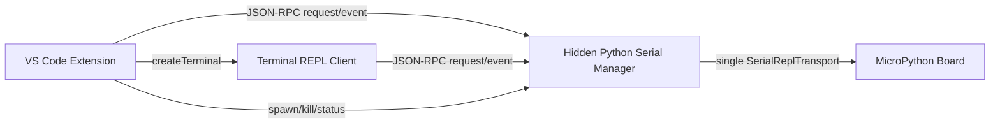

# VScodeMicroPython Hidden Serial Manager 架构迁移计划

生成时间: 2026-06-20 19:26:45
版本: v1

## 1. 目标与边界

主要目标:

- 将串口所有权从 VS Code Terminal 中的 `async-repl` 迁移到 extension 直接管理的隐藏 Python manager 进程.
- Terminal 只作为 REPL 客户端,不再直接打开或持有 COM 口.
- 文件操作、上传下载、删除、重命名、执行代码、interrupt、soft reset、补全运行时查询全部通过同一个 manager 串行访问设备.
- 删除或弱化当前 `auto-suspend REPL -> 文件操作 -> restore REPL` 模型,从根上避免多个进程抢同一串口.
- 保持代码可维护性: 拆分 TypeScript manager 生命周期、RPC 客户端、Terminal 客户端启动,拆分 Python manager 协议、会话、文件系统、REPL 客户端.

明确非目标:

- 不支持多个板子同时打开.本项目只维护一个 active serial manager;多板需求通过多开 VS Code 窗口解决.
- 不在本阶段重写为 Node 原生串口实现.
- 不直接依赖 Thonny/minny 内部 API,仅参考其 backend 独占串口模型.
- 不在第一版实现完整自定义 Pseudoterminal 行编辑器.
- 不引入遥测、远程服务或外部网络调用.manager RPC 只绑定本机回环地址.

成功标准:

- 打开 REPL 后,文件删除、上传、下载、目录刷新不再关闭 REPL,也不会出现 COM 口抢占.
- 点击 Close Serial 后,扩展能向 manager 发送 shutdown,等待 Python child process 退出,必要时 kill,并确认状态恢复.
- REPL Terminal 客户端退出不会导致串口残留;manager 退出时 Terminal 客户端能收到断开提示.
- 长文件上传期间显示准确进度、速度、取消状态;取消后 manager 能清理设备端临时文件.
- TypeScript 测试通过;Python 测试使用 `E:\xm\github\.conda\python.exe` 运行,本地 Python 覆盖率保持 80% 以上.

## 2. 项目现状

当前关键实现:

- `src/board/mpremoteCommands.ts`
  - 当前维护 `replTerminal`, `runTerminal`, `replUsesCustomClient`, `replControlFile`.
  - `getReplTerminal()` 在 VS Code Terminal 中启动 `scripts/mpyrepl/__main__.py ... async-repl`.
  - `closeReplTerminal()` 主要依赖 `replTerminal.dispose()`,没有可靠 Python child process 生命周期控制.

- `src/board/mpyClient.ts`
  - 文件操作入口.
  - 若 custom REPL control file 存在,走 `requestCustomReplRpc(..., "fs", ...)`.
  - 否则回退为启动临时 `mpyrepl fs` helper,该 helper 会重新打开 COM 口.

- `src/board/customReplControl.ts`
  - 当前基于临时 JSON 文件做 control/RPC.
  - 文件轮询协议缺少连接语义,容易 stale.

- `scripts/mpyrepl/__main__.py`
  - `run_async_repl()` 已经长期持有 `SerialReplTransport`.
  - `watch_control_channel()` 支持 `interrupt`, `soft-reset`, `interrupt-reset`, `exit`, `exec`, `fs`.
  - `SerialOperationGate` 已承担同一串口操作串行化.

- `scripts/mpyrepl/fs_ops.py`
  - 已有文件系统读写、上传进度、临时文件写入等逻辑.
  - 已实现更快的 base64 stdin stream 写入路径.

- `scripts/mpyrepl/completion_*`
  - 当前运行时补全能力依赖串口查询,未来应通过 manager 共享缓存和查询队列.

当前问题:

- 串口 owner 是 Terminal 内 Python 进程,extension 只有 `vscode.Terminal` 引用,没有 `ChildProcess`.
- Close Serial 只关闭 UI terminal 不等于 Python backend 已退出.
- control file 被清理后,残留 Python 进程仍可能持有 COM 口,后续 helper 打开串口失败.
- 文件操作和 REPL 在架构上仍是互斥抢口关系,靠 auto-suspend 规避,稳定性不足.
- `mpyClient` fallback 到 helper 的行为在 stale manager 状态下危险.

可复用资产:

- `SerialReplTransport`, `DeviceFsClient`, `SerialOperationGate`, `ReplCompleter`, `ReplSessionSymbols`, `fs_ops` 的现有 Python 实现.
- 当前 TypeScript 的 `mpyClient` 调用面,可以迁移为 manager RPC 适配层,减少上层文件操作改动.
- 当前 progress event 类型可以继续使用,但传输通道从 stdout marker 改为 RPC event.

## 3. 需求与疑问

已确认需求:

- 这是个人项目,允许大范围重构,体验优先.
- 不需要单 VS Code 窗口支持多个板子同时打开.
- 开发过程中仍要关注可维护性、文件体积、模块边界、测试覆盖.
- Python 覆盖率尽量保持在 80% 以上.
- 本地测试 Python 应使用 `E:\xm\github\.conda\python.exe`.

关键假设:

- 第一版 manager 使用 localhost TCP JSON-RPC,绑定 `127.0.0.1`,随机端口,随机 token.理由是 Node/Python 双端实现简单,支持事件流和多个客户端.
- Terminal REPL 客户端继续使用 Python prompt_toolkit,因此不需要在 VS Code Pseudoterminal 里重做行编辑.
- manager 内部同一时间只允许一个串口 operation,但 `status`, `cancel`, `interrupt`, `shutdown` 是 side command,可高优先级处理.
- `Run Active File` 第一阶段可通过 manager 执行当前文件内容;旧 run terminal 作为兼容路径逐步删除.

需实现前再次确认的非阻塞细节:

- REPL 执行遇到 `input()` 时,第一版是否要求交互输入完全可用.建议第一版支持普通代码块执行和 Ctrl-C 取消,`input()` 作为限制项记录.
- 文件上传过程中用户在 REPL 输入内容时,建议第一版提示 busy 或排队,不要并发执行.
- 是否保留一个设置项用于临时回退到旧 helper.建议短期保留 hidden setting,稳定后删除.

## 4. 总体方案设计

### 4.1 目标架构



职责划分:

- VS Code Extension:
  - 选择 port.
  - 启动/关闭 manager child process.
  - 保存 manager endpoint/token.
  - 启动 Terminal REPL client.
  - 文件树、上传、下载、删除、补全查询等 UI 命令通过 manager client 访问设备.

- Hidden Python Serial Manager:
  - 唯一打开并持有串口.
  - 维护 raw REPL 状态、helper 注入、运行时 symbol/completion cache.
  - 串行执行文件系统和代码执行操作.
  - 广播 stdout/stderr/progress/status 事件.
  - 处理 cancel/interrupt/shutdown.

- Terminal REPL Client:
  - 在普通 VS Code Terminal 里运行.
  - 使用 prompt_toolkit 管理输入、历史、Tab 补全、颜色显示.
  - 不打开串口,只连接 manager RPC.
  - 用户输入代码后发给 manager 执行,接收 output events 并显示.

### 4.2 RPC 协议

推荐协议:

- Transport: TCP `127.0.0.1:<random_port>`.
- Auth: manager 启动时生成随机 token,extension 通过环境变量/命令行传给 terminal client.
- Encoding: newline-delimited JSON,即 NDJSON.
- 每条 request 带 `id`, `method`, `params`, `token`.
- response 带 `id`, `ok`, `result` 或 `error`.
- event 带 `event`, `payload`,不带 `id`.

示例 request:

```json
{"id":"1","token":"...","method":"fs.writeFile","params":{"localPath":"...","devicePath":"/sd/a.py"}}
```

示例 response:

```json
{"id":"1","ok":true,"result":{"bytes":12345}}
```

示例 event:

```json
{"event":"progress","payload":{"operationId":"op-1","bytes":4096,"total":12345,"rate":45200}}
```

核心 method:

- `manager.ping`
- `manager.status`
- `manager.shutdown`
- `manager.cancel`
- `device.interrupt`
- `device.softReset`
- `repl.exec`
- `repl.complete`
- `repl.clearRuntimeCache`
- `fs.stat`
- `fs.listdir`
- `fs.tree`
- `fs.mkdir`
- `fs.remove`
- `fs.rename`
- `fs.readFile`
- `fs.writeFile`
- `fs.exec`

核心 event:

- `status`
- `stdout`
- `stderr`
- `progress`
- `operationStarted`
- `operationFinished`
- `operationFailed`
- `deviceDisconnected`

错误结构:

```json
{
  "code": "busy|cancelled|timeout|transport|device|protocol|not_found|permission|internal",
  "message": "human readable message",
  "details": {}
}
```

### 4.3 Manager 状态机

建议状态:

- `stopped`: 没有 manager child process.
- `starting`: extension 已 spawn,等待 endpoint ready.
- `ready`: 串口已打开,helper 已加载,可接受操作.
- `busy`: 正在执行普通串口 operation.
- `cancelling`: 已请求取消,等待当前 operation 恢复 raw REPL.
- `closing`: 正在 shutdown.
- `failed`: manager 异常退出或串口错误.

状态规则:

- `interrupt`, `cancel`, `shutdown`, `status` 可在 `busy` 时处理.
- 普通 `fs.*` 和 `repl.exec` 在 `busy` 时默认排队或返回 busy.第一版建议 extension UI 文件操作走队列,REPL client 输入直接显示 busy.
- manager 退出时必须关闭 serial transport.
- extension 收到 child `exit` 后必须清理 endpoint/token/状态,刷新 action view.

### 4.4 并发与取消

manager 内部:

- 保留或重命名 `SerialOperationGate`,所有会写串口的操作必须经 gate.
- side command 单独处理:
  - `status`: 直接返回当前状态.
  - `cancel`: 设置 cancellation flag,必要时调用 `transport.interrupt()`.
  - `interrupt`: 立即向设备发 Ctrl-C.
  - `shutdown`: 标记 closing,取消当前 operation,退出主循环.

上传取消:

- host 侧 stop 继续发送.
- device 侧如果使用 `.mpyupload` 临时文件,取消后尝试删除该临时文件.
- 若删除失败,返回 warning event,文件树刷新时可看到残留.

### 4.5 REPL 执行模型

第一版建议采用“代码块执行模型”:

- Terminal client 收集用户输入的一段代码.
- 调用 `repl.exec`.
- manager 进入 raw REPL 执行,将 stdout/stderr 作为 events 流式返回.
- 执行完成后返回 response,client 显示新 prompt.

优点:

- 与当前 `async-repl` 模型接近,迁移风险较低.
- 便于与文件操作共享 gate.
- 补全可以走同一个 `ReplCompleter`.

限制:

- `input()` 这种程序运行中交互输入第一版不保证完整体验.
- 长任务期间 REPL client 不能继续执行普通输入,只能 interrupt/cancel.

后续增强:

- 增加 `repl.stdin` method,支持运行中 input.
- 区分 interactive execution 和 management execution.

## 5. 文件级任务

### 5.1 Python 新增/拆分文件

新增 `scripts/mpyrepl/manager_protocol.py`

- 定义 JSON-RPC request/response/event 结构.
- 定义错误 code 常量.
- 提供 encode/decode/validation helper.

新增 `scripts/mpyrepl/manager_server.py`

- 启动 localhost TCP server.
- 管理客户端连接、认证 token、request dispatch、event broadcast.
- 不直接包含文件系统和 REPL 业务细节.

新增 `scripts/mpyrepl/manager_session.py`

- 负责 `SerialReplTransport` 生命周期.
- 负责 helper load、raw REPL recovery、operation gate.
- 暴露 `exec`, `complete`, `fs_*`, `interrupt`, `soft_reset`, `shutdown`.

新增 `scripts/mpyrepl/repl_client.py`

- Terminal 端 REPL client.
- 使用 prompt_toolkit 做输入、历史、补全 UI.
- 连接 manager RPC,不打开串口.

调整 `scripts/mpyrepl/__main__.py`

- 增加命令:
  - `manager`
  - `repl-client`
- 逐步把现有 `run_async_repl()` 逻辑拆到 `manager_session.py`.
- 保留旧命令短期兼容测试.

调整 `scripts/mpyrepl/fs_ops.py`

- 保持已有 `DeviceFsClient`.
- 抽出 progress callback/event adapter,供 manager event broadcast 使用.
- 保持现有测试覆盖.

调整 `scripts/mpyrepl/completion_*`

- 让 manager session 复用已有 `ReplCompleter`.
- completion 查询通过 `repl.complete` 暴露给 terminal client 和 extension.

### 5.2 TypeScript 新增/拆分文件

新增 `src/board/serialManagerTypes.ts`

- 定义 manager 状态、RPC 请求响应、错误、进度事件类型.

新增 `src/board/serialManagerProcess.ts`

- 负责 `spawn()` Python manager.
- 读取 manager ready line 或 endpoint file.
- 保存 child process,处理 exit/error.
- 负责 graceful shutdown 和 kill fallback.

新增 `src/board/serialManagerClient.ts`

- TCP JSON-RPC client.
- request timeout、event subscription、token auth、断线处理.
- 提供 `call(method, params, opts)`.

新增 `src/board/serialManager.ts`

- 对外暴露高层 API:
  - `ensureManagerStarted(port)`
  - `openReplClient()`
  - `closeManager(userInitiated)`
  - `getManagerStatus()`
  - `fs.*`
  - `repl.*`
- 维护 active manager 单例状态.

新增或调整 `src/board/managerBackedMpyClient.ts`

- 将现有 `mpyClient` 的 public API 映射到 manager RPC.
- 便于上层 `mpremote.ts` 少改.

调整 `src/board/mpyClient.ts`

- 第一阶段保留 helper fallback.
- 当 manager active 时,所有操作优先 manager.
- 后续可把旧 helper 路径移到 legacy 文件.

调整 `src/board/mpremoteCommands.ts`

- `openReplTerminal()` 改为:
  - ensure manager started.
  - create terminal running `repl-client --endpoint ... --token ...`.
- `closeReplTerminal()` 改为:
  - close terminal client.
  - shutdown manager.
  - 等待 child exit/kill fallback.
- 删除或弱化 `replControlFile` 相关状态.

调整 `src/commands/fileCommands.ts`, `src/commands/uploadToBoard.ts`, `src/board/boardOperations.ts`, `src/commands/syncCommands.ts`, `src/sync/activeFileSync.ts`

- 移除或绕过 auto-suspend.
- 文件操作直接调用 manager-backed `mpremote`/`mpyClient`.

调整 `src/core/actions.ts`, `src/core/extension.ts`

- action view 状态以 manager/repl client 状态为准.
- Close Serial 显示 manager closing/closed.

### 5.3 测试文件

新增/调整 Python 测试:

- `scripts/mpyrepl/test_manager_protocol.py`
- `scripts/mpyrepl/test_manager_server.py`
- `scripts/mpyrepl/test_manager_session.py`
- `scripts/mpyrepl/test_repl_client.py`

新增/调整 TypeScript 测试:

- `tests/serialManagerProcess.test.ts`
- `tests/serialManagerClient.test.ts`
- `tests/serialManagerIntegrationCoverage.test.ts`
- 调整 `tests/boardMpremoteCommandsCoverage.test.ts`
- 调整 `tests/fileCommandsCoverage.test.ts`

## 6. 分阶段执行

### 阶段 0: 基线整理与保护

任务:

- 记录当前测试基线.
- 明确不运行 `build.ps1`.
- 确认本地 Python 测试命令使用 `E:\xm\github\.conda\python.exe`.

涉及文件:

- 不修改源码.

验证:

```powershell
npm test -- --runInBand
& E:\xm\github\.conda\python.exe scripts\mpyrepl\run_python_tests_with_coverage.py
```

完成标准:

- 知道迁移前测试状态.
- 若已有失败,记录失败项,不要混入本次迁移误判.

### 阶段 1: Python manager 协议骨架

任务:

- 新增 `manager_protocol.py`.
- 新增 `manager_server.py` 的最小 TCP NDJSON server.
- 支持 `manager.ping`, `manager.status`, `manager.shutdown`.
- 支持 token 校验.

涉及文件:

- `scripts/mpyrepl/manager_protocol.py`
- `scripts/mpyrepl/manager_server.py`
- `scripts/mpyrepl/__main__.py`
- `scripts/mpyrepl/test_manager_protocol.py`
- `scripts/mpyrepl/test_manager_server.py`

验证:

- Python 单测.
- 手动启动 manager,用简单 client 发 ping.

完成标准:

- manager 可启动、输出 endpoint/token 或 ready payload.
- ping/status/shutdown 可正常返回.

### 阶段 2: TypeScript manager process/client

任务:

- 新增 TS 侧 process manager 和 RPC client.
- extension 能 spawn Python manager,等待 ready,调用 ping/status/shutdown.
- child exit 后正确清理状态.

涉及文件:

- `src/board/serialManagerTypes.ts`
- `src/board/serialManagerProcess.ts`
- `src/board/serialManagerClient.ts`
- `src/board/serialManager.ts`
- `tests/serialManagerProcess.test.ts`
- `tests/serialManagerClient.test.ts`

验证:

```powershell
npm test -- --runInBand
```

完成标准:

- TS 单测能用 fake child/fake socket 覆盖 start/shutdown/error/timeout.
- 不影响现有 open REPL 和文件操作.

### 阶段 3: Manager 接入串口 session

任务:

- 新增 `manager_session.py`.
- manager 启动时打开 `SerialReplTransport`,进入 raw REPL,加载 helper.
- 实现 `device.interrupt`, `device.softReset`, `repl.exec`.
- 暂时不改 VS Code REPL,先用测试或手动 RPC 验证.

涉及文件:

- `scripts/mpyrepl/manager_session.py`
- `scripts/mpyrepl/manager_server.py`
- `scripts/mpyrepl/__main__.py`
- `scripts/mpyrepl/test_manager_session.py`

验证:

- Python 单测使用 fake transport.
- 真设备手动 RPC 执行 `print(1)`,interrupt,soft reset.

完成标准:

- 单 manager 进程可独占 COM 口并执行代码.
- shutdown 后 serial close.

### 阶段 4: Terminal REPL client

任务:

- 新增 `repl_client.py`.
- 使用 prompt_toolkit 输入代码.
- 调用 `repl.exec`,显示 stdout/stderr events.
- 支持 Ctrl-C 转发 `device.interrupt`.
- 支持 `:exit` 退出 client,但不自动 shutdown manager.

涉及文件:

- `scripts/mpyrepl/repl_client.py`
- `scripts/mpyrepl/__main__.py`
- 可能复用/迁移 `completion_engine.py`, `completion_parser.py`, `completion_state.py`

验证:

- 手动启动 manager 后启动 repl-client.
- 执行简单代码、多行代码、Ctrl-C、`:exit`.

完成标准:

- Terminal client 不持有 COM 口.
- 关闭 Terminal client 后,manager 仍能服务文件操作.

### 阶段 5: VS Code Open/Close Serial 迁移

任务:

- `openReplTerminal()` 改为 ensure manager started,然后创建 terminal client.
- `closeReplTerminal()` 改为关闭 terminal client 并 shutdown manager.
- action view 状态绑定 manager 状态.
- 旧 `replControlFile` 路径保留但不再默认使用.

涉及文件:

- `src/board/mpremoteCommands.ts`
- `src/board/serialManager.ts`
- `src/core/actions.ts`
- `src/core/extension.ts`
- `tests/boardMpremoteCommandsCoverage.test.ts`

验证:

- 打开 REPL -> Close Serial -> 刷新目录不出现 COM 占用.
- Close Serial 后确认 manager child process 退出.

完成标准:

- 当前用户报告的“关闭串口但 REPL 仍活着”问题消失.

### 阶段 6: 文件操作迁移到 manager

任务:

- 实现 manager RPC:
  - `fs.stat`
  - `fs.listdir`
  - `fs.tree`
  - `fs.mkdir`
  - `fs.remove`
  - `fs.rename`
  - `fs.readFile`
  - `fs.writeFile`
- `mpyClient` manager active 时全部走 manager.
- 文件操作不再 auto-suspend REPL.
- 上传进度通过 manager event 进入 VS Code progress UI.

涉及文件:

- `scripts/mpyrepl/manager_session.py`
- `scripts/mpyrepl/fs_ops.py`
- `src/board/mpyClient.ts`
- `src/board/managerBackedMpyClient.ts`
- `src/commands/fileCommands.ts`
- `src/commands/uploadToBoard.ts`
- `src/board/boardOperations.ts`
- `src/commands/syncCommands.ts`
- `src/sync/activeFileSync.ts`

验证:

- REPL 打开时 list/delete/upload/download/open file.
- 大文件上传取消.
- `.mpyupload` 临时文件清理.

完成标准:

- 常规文件操作不需要关闭 REPL.
- 不再有 helper 抢 COM 口路径.

### 阶段 7: 补全迁移

任务:

- `repl.complete` 通过 manager 调用现有 `ReplCompleter`.
- Terminal client Tab 补全走 manager.
- extension 侧补全需要运行时查询时走 manager,共享缓存.
- 执行成功后 manager 更新 symbol/runtime cache.

涉及文件:

- `scripts/mpyrepl/manager_session.py`
- `scripts/mpyrepl/repl_client.py`
- `scripts/mpyrepl/completion_engine.py`
- `src/completion/...`
- `src/board/serialManagerClient.ts`

验证:

- lvgl 等大模块补全.
- 输入一个字母、多字母、删除字符后补全结果稳定.
- 文件操作期间补全返回 busy 或使用缓存,不阻塞 UI 很久.

完成标准:

- 补全不再依赖 terminal 内部状态,统一由 manager 维护.

### 阶段 8: 移除旧 control file/auto-suspend 主路径

任务:

- 删除或标记 legacy:
  - `customReplControl.ts`
  - `async-repl` file-control 主路径
  - `suspendSerialSessionsForAutoSync` 默认使用
- 保留有限 fallback 设置,便于回滚.
- 更新 README/配置说明.

涉及文件:

- `src/board/customReplControl.ts`
- `src/board/mpremoteCommands.ts`
- `src/board/mpyClient.ts`
- `scripts/mpyrepl/control.py`
- `scripts/mpyrepl/__main__.py`
- `README.md`
- `README_zh-CN.md`
- `package.nls*.json` 如有新增设置或命令文案

验证:

- 全量测试.
- 真设备回归.

完成标准:

- 新架构成为默认路径.
- 旧路径仅保留明确 legacy fallback.

## 7. 验证计划

常规测试:

```powershell
npm test -- --runInBand
& E:\xm\github\.conda\python.exe scripts\mpyrepl\run_python_tests_with_coverage.py
git diff --check
```

禁止项:

- 不要为了普通验证运行 `build.ps1`,因为它会自动 bump 版本.

真设备测试清单:

- 打开 REPL,执行 `print(123)`.
- REPL 打开时刷新 `/`, `/lib`, `/sd`.
- REPL 打开时删除文件.
- REPL 打开时上传小 `.py` 文件.
- REPL 打开时上传大文件,观察速度、进度、取消.
- 上传取消后确认 `.mpyupload` 被清理.
- 上传期间点击 Close Serial,确认 manager 退出、串口释放.
- 关闭 REPL Terminal client 但不 Close Serial,确认文件操作仍可用.
- Close Serial 后立即刷新目录,确认没有 `PermissionError`.
- 连续 open/close 10 次,确认没有 Python 残留进程持有 COM.

覆盖率要求:

- Python 本地覆盖率尽量保持 `>= 80%`.
- 新增 manager protocol/server/session 需要单元测试,不能只依赖真设备测试.

## 8. 风险与注意事项

### RPC 安全

- manager 必须只绑定 `127.0.0.1`.
- token 必须随机生成,不要写入日志或文档.
- 不接受无 token 请求.
- 不添加任何外部网络访问.

### 进程生命周期

- extension 必须保存 child process handle.
- shutdown 流程:
  1. 发送 `manager.shutdown`.
  2. 等待 child `exit`.
  3. 超时后 kill child.
  4. 清理 endpoint/token/state.
  5. 刷新 action view.
- Terminal client 退出不等于 manager 退出.

### 串口协议

- 同一时间只能有一个普通串口 operation.
- side command 要谨慎打断 operation,打断后必须恢复 raw REPL 或标记 manager failed.
- 文件上传中断后可能需要重新进入 raw REPL.

### UI/体验

- REPL busy 时,Terminal client 应明确提示当前正在执行上传/文件操作.
- VS Code progress 必须有取消按钮.
- Close Serial 在 closing 状态期间应防止重复点击导致状态错乱.

### 可维护性

- 不要继续把所有逻辑塞进 `mpremoteCommands.ts` 或 `__main__.py`.
- Python 侧每个文件职责保持单一:
  - protocol
  - server
  - session
  - fs
  - repl client
- TypeScript 侧每个文件职责保持单一:
  - process lifecycle
  - RPC client
  - high-level manager facade
  - legacy adapter

### 兼容性

- Windows 是主要环境,要重点验证 PowerShell、路径空格、中文路径、COM 口释放延迟.
- Python 版本以本地 `.conda` 环境和打包环境兼容为准.
- VSIX 打包时确保新增 Python 文件被包含.

## 9. 建议实施顺序

推荐先完成阶段 1-5,形成最小闭环:

- extension 启动 hidden manager.
- terminal client 可连接 manager.
- Open/Close Serial 生命周期可靠.
- 简单 `repl.exec` 可用.

然后再迁移文件操作和补全:

- 文件操作迁移是解决抢串口的核心收益.
- 补全迁移可以在 manager 稳定后做,避免同时改太多.

## 10. 当前状态

当前仅完成计划,尚未开始编码,需用户确认后再实施.
